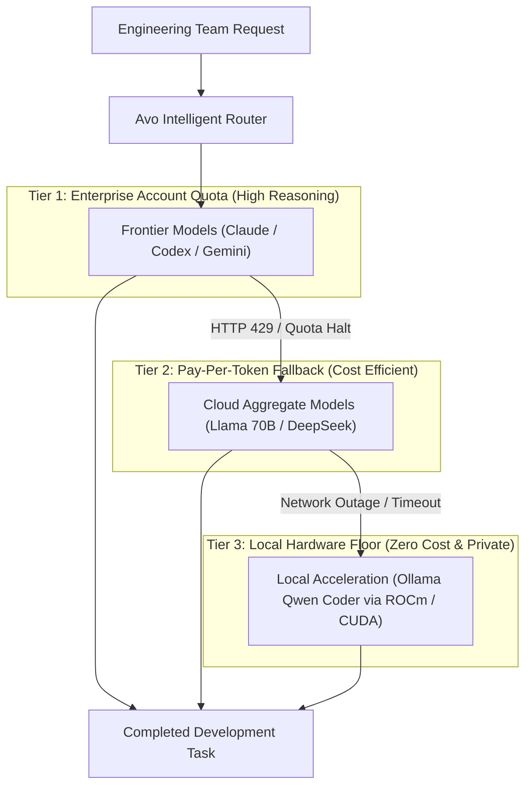
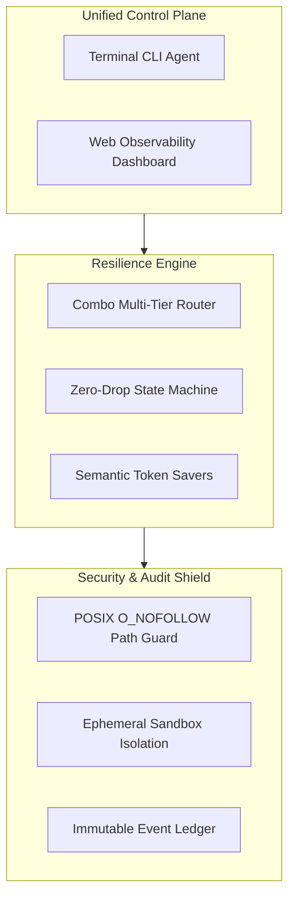

# Avo

**Enterprise-Grade AI Agent Infrastructure with Zero-Downtime Multi-Tier Redundancy & Cost Optimization**

*Eliminate developer idle time, mitigate AI vendor lock-in, and slash enterprise token expenditures across your engineering organization.*

---

## Executive Summary

Modern engineering teams increasingly rely on AI coding assistants for software delivery. However, conventional single-vendor tools introduce severe operational vulnerabilities: **HTTP 429 quota exhaustion**, **cloud provider outages**, **unpredictable monthly token invoices**, and **uncontrolled code execution risks**.

**Avo** is an open-source, multi-tier autonomous AI agent runtime engineered for uninterrupted software engineering workflows. By unifying enterprise cloud account quotas, pay-as-you-go fallbacks, and zero-cost local hardware inference behind a resilient state machine, Avo guarantees that mission-critical development never halts.

---

## The Business Problem vs. The Avo Solution

| Business Challenge | Industry Impact | The Avo Strategic Solution |
|---|---|---|
| **Vendor Quota Halts & 429 Limits** | Developer workflows crash mid-refactor; context is permanently lost; engineering velocity drops. | **Zero-Drop Failover:** Automated provider hot-swap in milliseconds while preserving 100% conversation memory. |
| **Exploding Cloud Token Invoices** | Repetitive context ingestion and multi-turn audits rapidly burn budget on enterprise models. | **Integrated Token Savers:** Deterministic prompt minification and tool deduplication reduce token consumption by up to 26%+ (benchmarked). |
| **Vendor Lock-In & Outage Vulnerability** | Teams are tied to a single AI vendor's pricing models, service availability, and terms. | **Multi-Tier Redundancy:** Fluid routing across Anthropic, OpenRouter, Google, and on-premise models. |
| **Compliance & Code Tampering Risks** | Unrestricted AI tool loops may overwrite production assets or escape directory bounds. | **Defense-in-Depth:** Ephemeral sandbox isolation, strict POSIX file boundaries, and immutable audit logs. |

---

## Strategic Architecture

### 1. Cost-Optimized Multi-Tier Routing (Combo Pipeline)

Avo eliminates single-point-of-failure risks by cascading model execution through cost-prioritized operational tiers. When a primary cloud provider reaches rate limits or encounters latency spikes, requests transition down the tier hierarchy seamlessly.

---

### 2. Multi-Agent Collaborative Governance

Complex software delivery requires segregation of duties. Rather than relying on a single monolithic prompt, Avo orchestrates specialized subagents to enforce architectural compliance before implementation begins.

```mermaid
flowchart LR
    Goal["Business Initiative"] --> Architect["@architect Agent (System Design)"]
    Architect --> Spec["Architecture Plan & Concurrency Audit"]
    Spec --> Coder["@coder Agent (Implementation)"]
    Coder --> Sandbox["Isolated Ephemeral Sandbox"]
    Sandbox --> Test["Automated Regression Verification"]
    Test --> Ledger["Durable SQLite Audit Ledger"]
    Ledger --> Telemetry["Real-Time Web UI Dashboard"]
```

---

## Core Business Pillars

### 📊 1. Measurable ROI & Financial Governance
- **Deterministic Token Reduction:** Automatically minifies tool JSON payloads, deduplicates redundant outputs, and elides verbose lines, reducing token consumption by up to **26%+** on long tool-heavy sessions (see [benchmark results](benchmark/savers/RESULTS.md)).
- **Tiered Spending Caps:** Organizations leverage free or pre-paid enterprise quota first, spill over to fractional-cent pay-as-you-go providers second, and maintain a zero-cost local compute floor as the final safety net.
- **Granular Cost Transparency:** View exact per-turn and aggregate expenditures categorized by provider tier directly within the operational ledger.

### 🛡️ 2. Business Continuity & High Availability
- **Mid-Turn State Preservation:** When an upstream vendor encounters service degradation, Avo migrates pending turns to alternate providers without requiring developers to restart their session.
- **On-Premise Hardware Autonomy:** Automated hardware discovery configures local GPU accelerators (AMD ROCm, NVIDIA CUDA, Apple Metal) so core coding loops remain operable even during complete internet connectivity loss.

### 🔒 3. Enterprise Security & Audit Compliance
- **POSIX Boundary Containment:** Strict POSIX path resolution with `O_NOFOLLOW` symlink containment blocks directory traversal, null-byte poisoning, and symlink replacement attacks.
- **Containerized Isolation:** Code execution operates within disposable, ephemeral Docker sandboxes with disabled external networking and dropped capabilities by default.
- **Immutable SQLite Ledger:** Every prompt, decision boundary, tool mutation, and model switch is stored chronologically for compliance review and security auditing.

### ⚡ 4. Operational Observability (Avo Web UI)
- **Real-Time Operational Cockpit:** Visual telemetry dashboard displaying live trace timelines, model latency meters, circuit breaker triggers, and local hardware configuration.
- **Extensible Enterprise Plugins:** Seamless integration with company-internal ticketing systems, GitHub pull request automation, and incident alert channels via standard extension points.

---

## Enterprise Capability Overview

---

## Platform Deployment & Governance

Avo is engineered as a lean, dependency-minimal binary with self-contained runtime management. It adapts automatically to developer workstations, cloud virtual machines, and restricted air-gapped environments without requiring administrative overhead.

For enterprise deployment guides, architectural whitepapers, compliance specifications, and CLI references, visit the official documentation portal:

👉 **[Explore Full Documentation & Guides at avo.faqihhakim.tech](https://avo.faqihhakim.tech/)**

---

## License & Attribution

Avo is open-source software distributed under the **MIT License**. Maintained and authored by **Fqih**.
