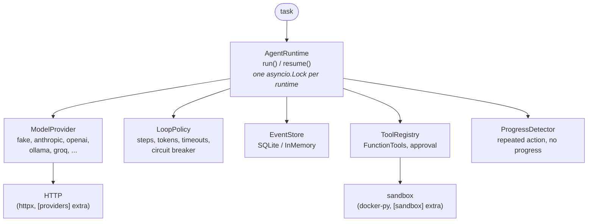

# Avo API Reference

**Package:** `avo` **Version:** `0.7.1` (`src/avo/__init__.py: __version__ = "0.7.1"`)
**Python:** `>=3.11` **Core dependency:** `pydantic>=2.8,<3` (only one)
**Stable ABI target:** `0.2.0` (`_STABLE_ABI` in `src/avo/__init__.py`)

This document is the complete, verbatim API reference for the `avo`
agent runtime. Every signature, field, enum member, env var, and error
string below was read from source under `src/avo/`. When this document
disagrees with another doc, this document wins; when this document
disagrees with the code, the code wins — fix the document.

CLAUDE.md cites this file by section number (e.g. "reference §3.1",
"§5", "§6", "§9", "§19", "§22"). **Do not renumber existing sections.**

## Contents

1. [Overview and architecture](#1-overview-and-architecture)
2. [Public API surface](#2-public-api-surface)
3. [Core contracts](#3-core-contracts)
4. [Core data models](#4-core-data-models-srcavomodelspy)
5. [State machine](#5-state-machine-srcavostatepy)
6. [Event store and event invariants](#6-event-store-and-event-invariants-srcavoeventspy)
7. [Providers](#7-providers-srcavoproviders)
8. [AgentRuntime](#8-agentruntime-srcavoruntimepy)
9. [Tools: registry, schemas, fingerprints](#9-tools-registry-schemas-fingerprints)
10. [Application tools and the sandbox](#10-application-tools-and-the-sandbox-srcavoapp_tools)
11. [Storage](#11-storage-srcavostorage)
12. [Configuration and environment variables](#12-configuration-and-environment-variables-srcavoconfigpy)
13. [MCP server and client](#13-mcp-server-and-client)
14. [CLI](#14-cli-srcavoclipy-avo-avoclimain)
15. [Native extension (`avo_native`)](#15-native-extension-avo_native)
16. [Reliability primitives](#16-reliability-primitives)
17. [Usage, cost, ledger, compaction, context](#17-usage-cost-ledger-compaction-context)
18. [Extensibility: hooks, permissions, skills, plugins, subagents](#18-extensibility-hooks-permissions-skills-plugins-subagents)
19. [Design principles](#19-design-principles)
20. [Observability](#20-observability)
21. [Integrations, chat REPL, web UI](#21-integrations-chat-repl-web-ui)
22. [Quality gates](#22-quality-gates)
23. [Conventions and anti-patterns](#23-conventions-and-anti-patterns)

---

## 1. Overview and architecture

Avo is an **event-sourced agent runtime**: every state change of a run
is appended to an immutable event log, durable checkpoints allow
crash-safe resume, and policies (step caps, token budgets, loop
detectors, circuit breakers) bound runaway loops with deterministic
`StopReason`s.



Message flow for one step:

1. `MODEL_PENDING` — runtime builds a `ModelRequest`, calls
   `provider.generate()` (or `stream()` when the provider supports it
   and a `stream_callback` is set).
2. `DECISION_RECEIVED` — response is `content` (final answer) or a
   `tool_call`.
3. `TOOL_PENDING` → `APPROVAL_PENDING` → `TOOL_EXECUTING` — approval
   goes through `approval_callback`; execution goes through
   `ToolRegistry.invoke()`.
4. `OBSERVATION_RECORDED` — the `ToolResult` is appended as a
   `role: "tool"` message; loop detectors record the observation.
5. Back to `MODEL_PENDING` until a terminal state or a policy stop.

Each of those transitions is a `STATE_CHANGED` event, and a `Checkpoint`
is written per step (or at least after every model decision and every
tool result, depending on `LoopPolicy.checkpoint_every_step`).

Key modules and their one-line responsibility (first docstring line):

| Module | Responsibility |
|---|---|
| `avo/models.py` | Pydantic domain models shared across the runtime |
| `avo/state.py` | `RunState` / `StopReason` enums and the transition table |
| `avo/events.py` | `AgentEvent`, `EventType`, append-time invariants |
| `avo/policies.py` | `LoopPolicy` bounds (steps, tokens, runtime, loops) |
| `avo/tools.py` | `FunctionTool`, `ToolRegistry`, schema helpers |
| `avo/runtime.py` | `AgentRuntime.run()` / `resume()` / `inspect()` |
| `avo/runtime_handlers.py` | Per-state handler functions (the loop body) |
| `avo/runtime_persistence.py` | Event append, transition, checkpoint, terminate helpers |
| `avo/providers/` | Model adapters (`ModelProvider` implementations) |
| `avo/savers/` | Opt-in deterministic request compression and terse-output presets |
| `avo/storage/` | `EventStore` implementations (SQLite, in-memory) |
| `avo/config.py` | Env-driven provider construction (`build_provider_from_env`) |
| `avo/app_tools/` | Workspace-bounded file/shell/git tools + Docker sandbox |
| `avo/mcp.py`, `avo/mcp_server/`, `avo/mcp_servers/` | MCP client, stdio server, built-in servers |
| `avo/cli.py` (+ `cli_*.py`) | The `avo` console script |
| `avo/_native.py`, `native/` | Optional Rust accelerator (fallback mandatory) |

## 2. Public API surface

`src/avo/__init__.py` re-exports exactly `__all__` (stable public API;
everything else is internal and may change without notice):

```python
__all__ = [
    "AgentEvent", "AgentRuntime", "Checkpoint", "DeprecatedSymbol",
    "EventType", "FakeProvider", "FunctionTool", "LetheMemoryAdapter",
    "LoopPolicy", "MemoryProvider", "ModelRequest", "ModelResponse",
    "OtelDisabledError", "ProgressDetector", "RunRecord", "RunResult",
    "RunState", "RunTrace", "ScriptItem", "StopReason", "TokenUsage",
    "Tool", "ToolCall", "ToolMetadata", "ToolRegistry", "ToolResult",
    "TraceEntry", "TraceInspector",
    "configure_tracer", "deprecated", "deprecation_index", "is_enabled",
    "span_for_turn", "to_anthropic_tool", "to_json_schema",
    "to_openai_function",
]
```

Canonical minimal usage (what all tests do):

```python
from avo import (
    AgentRuntime, FakeProvider, FunctionTool, LoopPolicy, ModelResponse,
    ToolRegistry,
)

provider = FakeProvider([ModelResponse(content="done")])
runtime = AgentRuntime(provider=provider, tools=[], policy=LoopPolicy(max_steps=5))
result = await runtime.run("say done")
assert result.status.value == "completed"
```

`avo.runtime` additionally exposes `AgentRuntime`, `ApprovalCallback`,
`Clock`, and the internal `_RunContext` (underscore-prefixed; not for
external use). Provider protocol types (`ModelProvider`,
`StatefulModelProvider`, `StreamingModelProvider`) are importable from
`avo.providers` / `avo.providers.base` but are not in the top-level
`__all__`.

## 3. Core contracts

These three contracts are the extension points. CLAUDE.md's rules
reference §3.1 (FunctionTool) and §3.3 (LoopPolicy timeout).

### 3.1 `FunctionTool` (src/avo/tools.py)

```python
ToolCallable = Callable[[ArgumentsT], JsonValue | Awaitable[JsonValue]]

class FunctionTool(Generic[ArgumentsT]):
    def __init__(
        self,
        *,
        name: str,
        description: str,
        arguments_model: type[ArgumentsT],
        function: ToolCallable[ArgumentsT],
    ) -> None: ...
```

- All four parameters are **keyword-only**.
- `arguments_model` must be a Pydantic `BaseModel` subclass; `metadata`
  deep-copies the JSON schema via `to_json_schema(model)`.
- `async invoke(arguments)` behavior:
  - `model_validate` failure raises `ToolValidationError`.
  - Any exception from `function` is wrapped:
    `ToolExecutionError(f"Tool {name!r} raised {type(exc).__name__}: {exc}")`.
  - The returned object is JSON-adapted before becoming output.
- The `Tool` protocol (what the registry accepts):

```python
@runtime_checkable
class Tool(Protocol):
    @property
    def metadata(self) -> ToolMetadata: ...
    async def invoke(self, arguments: Mapping[str, JsonValue]) -> JsonValue: ...
```

**Contract:** your `function` returns a plain object (usually `dict`).
Never return both success and error; never wrap into `ToolResult`
yourself — the registry does that (§3.2).

### 3.2 `ToolRegistry` (src/avo/tools.py)

```python
class ToolRegistry:
    def __init__(self, tools: Iterable[Tool] = ()) -> None: ...
    def register(self, item: Tool) -> Tool: ...      # DuplicateToolError on name clash
    @property
    def metadata(self) -> list[ToolMetadata]: ...    # registration order
    def get(self, name: str) -> Tool: ...            # ToolNotFoundError if absent
    async def invoke(
        self,
        call: ToolCall,
        *,
        completed_tool_call_ids: set[str],           # REQUIRED keyword — no default
    ) -> ToolResult: ...
```

`invoke()` semantics, verbatim from source:

- If `call.tool_call_id in completed_tool_call_ids` → raise
  `ToolAlreadyCompletedError` (idempotency guard; **do not** pass a
  mutable global — the runtime owns the set per run).
- `ToolNotFoundError`, `ToolValidationError`, `ToolExecutionError` are
  caught and returned as `ToolResult(success=False, error=str(exc))`;
  anything else propagates.
- Success path returns `ToolResult(success=True, output=...)` with
  `duration_ms` measured via `time.perf_counter`.

> Note: `docs/api-stability.md` shows a default value for
> `completed_tool_call_ids`. That is **stale** — source has no default
> and callers must pass the set explicitly.

### 3.3 `LoopPolicy` (src/avo/policies.py)

```python
class LoopPolicy(BaseModel):
    model_config = ConfigDict(extra="forbid", frozen=True)

    max_steps: int = 20                    # gt=0
    max_runtime_seconds: float | None = 300  # gt=0
    max_input_tokens: int | None = None
    max_output_tokens: int | None = None
    max_total_tokens: int | None = None
    repeated_action_limit: int = 3
    consecutive_error_limit: int = 3
    no_progress_window: int = 5
    checkpoint_every_step: bool = True
    provider_timeout_seconds: float = 60
    tool_timeout_seconds: float = 60       # CLAUDE.md rule 3: the ONLY tool timeout
    circuit_breaker: CircuitBreakerPolicy | None = None
```

Methods:

```python
def token_budget_reason(self, usage: TokenUsage, *, accounting_available: bool) -> StopReason | None
def runtime_reason(self, elapsed_seconds: float) -> StopReason | None  # fires on >= max_runtime_seconds
```

`extra="forbid"` + `frozen=True`: no unknown keys, no mutation.
`PermissionPolicy` is **not** here — it lives in `avo/permissions.py`
(§18).

## 4. Core data models (src/avo/models.py)

All models derive from:

```python
class AvoModel(BaseModel):
    model_config = ConfigDict(extra="forbid", validate_assignment=True)
```

Helpers: `new_id() -> str` (UUID4 string) and `utc_now() -> datetime`
(timezone-aware UTC). Every datetime field is validated by
`_require_aware` — naive datetimes are rejected.

### `TokenUsage`

```python
TokenUsage(input_tokens: int = 0, output_tokens: int = 0)  # both ge=0
    .total_tokens   # property, input + output
    .plus(other)    # returns a new TokenUsage
```

### `ToolMetadata`

```python
ToolMetadata(
    name: str,           # min_length=1
    description: str,    # min_length=1
    input_schema: dict[str, JsonValue],
)
```

### `ToolCall`

```python
ToolCall(
    tool_call_id: str = Field(default_factory=new_id),
    name: str,
    arguments: dict[str, JsonValue] = Field(default_factory=dict),
)
```

### `ToolResult`

```python
ToolResult(
    tool_call_id: str,
    tool_name: str,
    success: bool,
    output: JsonValue | None = None,
    error: str | None = None,
    started_at: datetime,
    finished_at: datetime,
    duration_ms: float = 0,        # ge=0
)
```

Validation (`validate_success_payload`), exact messages:

- `success=True` and `error` set → `ValueError("a successful tool result cannot contain an error")`
- `success=False` without `error` → `ValueError("a failed tool result must contain an error")`
- `finished_at < started_at` → error.

### `ModelRequest` / `ModelResponse`

```python
ModelRequest(
    request_id: str,
    run_id: str,                      # min_length=1
    step: int,                        # ge=1
    messages: list[dict[str, JsonValue]],
    tools: list[ToolMetadata] = [],
    cache: bool = False,
    cache_prefix_messages: int | None = None,   # ge=0
)

ModelResponse(
    response_id: str,
    content: str | None = None,
    tool_call: ToolCall | None = None,
    usage: TokenUsage | None = None,
)
```

`ModelResponse` enforces exactly one of `content` / `tool_call`:
`"model response must contain exactly one of content or tool_call"`.
`is_final` is `True` for plain content responses.

### `RunRecord`, `Checkpoint`, `RunResult`

```python
RunRecord(
    run_id: str,
    task: str,                        # min_length=1
    state: RunState = RunState.CREATED,
    stop_reason: StopReason | None = None,
    output: str | None = None,
    error: str | None = None,
    steps: int = 0,
    token_usage: TokenUsage = TokenUsage(),
    token_accounting_available: bool = True,
    user_state: dict[str, JsonValue] = {},
    created_at: datetime,
    updated_at: datetime,
    duration_seconds: float | None = None,
)   # validator: terminal state / stop_reason must agree (§5)

Checkpoint(
    checkpoint_id: str,
    run_id: str,
    created_at: datetime,
    state: RunState,
    messages: list[dict[str, JsonValue]],
    next_step: int,                   # ge=1
    token_usage: TokenUsage,
    token_accounting_available: bool,
    consecutive_errors: int,
    repeated_action_history: list[str],
    observation_fingerprints: list[str],
    model_response_fingerprints: list[str],
    progress_markers: list[str],
    completed_tool_call_ids: set[str],
    user_state: dict[str, JsonValue],
    policy: dict[str, Any],
    provider_metadata: dict[str, JsonValue],
    pending_response: ModelResponse | None,
    last_event_sequence: int = 0,
)

RunResult(
    run_id: str,
    status: RunState,
    stop_reason: StopReason | None,
    output: str | None,
    error: str | None,
    steps: int,
    token_usage: TokenUsage,
    token_accounting_available: bool,
)   # what run()/resume() return
```

### Exceptions (src/avo/exceptions.py)

```
AvoError(Exception)
├── InvalidStateTransitionError
├── RunNotFoundError
├── RunAlreadyTerminalError
├── CheckpointNotFoundError
├── UnsafeResumeError
├── DuplicateToolError
├── ToolNotFoundError
├── ToolValidationError
├── ToolExecutionError        # aliases: NotifierError, SandboxError, MCPError, SkillError
├── ToolAlreadyCompletedError
├── StorageError
│   └── EventInvariantError
└── ProviderError(message, *, retryable: bool = True)   # attribute .retryable
    └── FakeProviderExhaustedError                      # retryable=False
```

`ConfigError(ValueError)`, `HistoryError`, `McpCliError`, `AuthError`,
`AuditError`, `MetricsError`, `PluginError(=AvoError)`,
`ConcurrencyError`, `RateLimitError(=AvoError)`, `CheckpointError(=AvoError)`,
`SchemaError(=AvoError)`, `ValidationFailure(=AvoError)`,
`WorkspacePathError(AvoError)`, `SubAgentError(=AvoError)` are module
local. `EditFileError` and `WorkspaceNotBoundError` /
`SandboxNotBoundError` are `RuntimeError` subclasses.

## 5. State machine (src/avo/state.py)

### `RunState` (StrEnum — 12 members)

| Member | Value | Kind |
|---|---|---|
| `CREATED` | `"created"` | initial |
| `MODEL_PENDING` | `"model_pending"` | working |
| `DECISION_RECEIVED` | `"decision_received"` | working |
| `TOOL_PENDING` | `"tool_pending"` | working |
| `APPROVAL_PENDING` | `"approval_pending"` | waiting |
| `TOOL_EXECUTING` | `"tool_executing"` | working |
| `OBSERVATION_RECORDED` | `"observation_recorded"` | working |
| `PAUSED` | `"paused"` | resumable |
| `COMPLETED` | `"completed"` | terminal |
| `FAILED` | `"failed"` | terminal |
| `STOPPED` | `"stopped"` | terminal |
| `CANCELLED` | `"cancelled"` | terminal |

`TERMINAL_STATES = {COMPLETED, FAILED, STOPPED, CANCELLED}`.

> `docs/api-stability.md` lists `INIT / RUNNING / WAITING_TOOL /
> WAITING_APPROVAL / COMPACTING` — those values **do not exist** in
> source. The table above is authoritative.

### Transition table (`_ALLOWED_TRANSITIONS`)

| From | Allowed targets |
|---|---|
| `CREATED` | `MODEL_PENDING`, `PAUSED`, `FAILED`, `CANCELLED` |
| `MODEL_PENDING` | `DECISION_RECEIVED`, `PAUSED`, `FAILED`, `STOPPED`, `CANCELLED` |
| `DECISION_RECEIVED` | `TOOL_PENDING`, `COMPLETED`, `PAUSED`, `FAILED`, `STOPPED`, `CANCELLED` |
| `TOOL_PENDING` | `APPROVAL_PENDING`, `PAUSED`, `FAILED`, `STOPPED`, `CANCELLED` |
| `APPROVAL_PENDING` | `TOOL_EXECUTING`, `PAUSED`, `FAILED`, `STOPPED`, `CANCELLED` |
| `TOOL_EXECUTING` | `OBSERVATION_RECORDED`, `PAUSED`, `FAILED`, `STOPPED`, `CANCELLED` |
| `OBSERVATION_RECORDED` | `MODEL_PENDING`, `PAUSED`, `FAILED`, `STOPPED`, `CANCELLED` |
| `PAUSED` | every non-terminal state except `PAUSED`, plus `FAILED`, `STOPPED`, `CANCELLED` |
| terminals | (none) |

Violations raise `InvalidStateTransitionError`.

### `StopReason` (StrEnum — 13 members) and state agreement

Members: `COMPLETED`, `MAX_STEPS`, `MAX_RUNTIME`, `TOKEN_BUDGET_EXCEEDED`,
`REPEATED_ACTION`, `NO_PROGRESS`, `CONSECUTIVE_ERRORS`, `POLICY_DENIED`,
`USER_CANCELLED`, `PROVIDER_ERROR`, `TOOL_ERROR`, `INVALID_MODEL_RESPONSE`,
`INTERNAL_ERROR`.

`_STOP_REASONS_BY_STATE` (validated by `validate_terminal_outcome`):

| Terminal state | Permitted stop reasons |
|---|---|
| `COMPLETED` | `COMPLETED` |
| `STOPPED` | `MAX_STEPS`, `MAX_RUNTIME`, `TOKEN_BUDGET_EXCEEDED`, `REPEATED_ACTION`, `NO_PROGRESS`, `CONSECUTIVE_ERRORS`, `POLICY_DENIED` |
| `FAILED` | `PROVIDER_ERROR`, `TOOL_ERROR`, `INVALID_MODEL_RESPONSE`, `INTERNAL_ERROR` |
| `CANCELLED` | `USER_CANCELLED` |

Functions: `is_terminal(state) -> bool`,
`validate_transition(current, target)`, and
`validate_terminal_outcome(state, reason)`.

## 6. Event store and event invariants (src/avo/events.py)

### `AgentEvent`

```python
AgentEvent(
    event_id: str,
    run_id: str,
    sequence: int = 0,            # ge=0; assigned by the store
    event_type: EventType,
    created_at: datetime,
    payload: dict[str, JsonValue] = {},
    parent_event_id: str | None = None,
)
```

### `EventType` (StrEnum — 20 members)

`RUN_CREATED`, `STATE_CHANGED`, `MODEL_REQUESTED`, `MODEL_RESPONDED`,
`MODEL_FAILED`, `ROUTE_FAILOVER`, `SAVER_APPLIED`, `TOOL_REQUESTED`, `TOOL_APPROVAL_REQUESTED`,
`TOOL_APPROVED`, `TOOL_DENIED`, `TOOL_STARTED`, `TOOL_COMPLETED`,
`TOOL_FAILED`, `POLICY_TRIGGERED`, `CHECKPOINT_CREATED`, `RUN_RESUMED`,
`RUN_COMPLETED`, `RUN_FAILED`, `RUN_STOPPED`, `RUN_CANCELLED`.

`TERMINAL_EVENT_TYPES = {RUN_COMPLETED, RUN_FAILED, RUN_STOPPED,
RUN_CANCELLED}`.

Standard payloads (as emitted by `runtime_persistence` /
`runtime_handlers`):

| Event | Payload keys |
|---|---|
| `RUN_CREATED` | `task`, `policy` |
| `STATE_CHANGED` | `from_state`, `to_state` |
| `MODEL_RESPONDED` | `step`, `response`, `duration_ms`, `token_accounting_available` |
| `MODEL_FAILED` | includes `error_type`, `consecutive_errors` |
| `SAVER_APPLIED` | `preset`, `stages_applied`, `tokens_before`, `tokens_after`, `saved_percent`, `message_count`, `addendum` |
| `TOOL_APPROVAL_REQUESTED` | `tool_call_id`, `idempotency_key`, `name`, `mode: "v0.1_callback"` |
| `TOOL_DENIED` | `reason`, `blocked_by` (`"hook"` or approval denial) |
| `CHECKPOINT_CREATED` | `checkpoint_id`, `state`, `next_step` |
| `POLICY_TRIGGERED` | `policy`, `stop_reason`, `state`, `steps`, `elapsed_seconds` |
| `RUN_RESUMED` | `checkpoint_id`, `checkpoint_sequence`, `state` |
| terminal (`RUN_COMPLETED`/`RUN_FAILED`/`RUN_STOPPED`/`RUN_CANCELLED`) | `state`, `stop_reason`, `output`, `error`, `steps`, `token_usage`, `token_accounting_available` |

### Append-time invariants (`validate_event_append`)

Violations raise `EventInvariantError`. The rules, verbatim behavior:

1. The first event of a run must be `RUN_CREATED`; exactly one.
2. Nothing may be appended after a terminal event.
3. `STATE_CHANGED` payloads must carry a transition legal per §5.
4. `TOOL_COMPLETED` / `TOOL_FAILED` require a prior `TOOL_STARTED` with
   the same `tool_call_id`, and no second result for the same call.
5. Terminal events must carry a state/stop-reason pair compatible with
   §5's `_STOP_REASONS_BY_STATE`.
6. `RUN_COMPLETED` requires a prior `MODEL_RESPONDED`.

## 7. Providers (src/avo/providers/)

### 7.1 Protocols

`avo/providers/base.py`:

```python
@runtime_checkable
class ModelProvider(Protocol):
    async def generate(self, request: ModelRequest) -> ModelResponse: ...

class StatefulModelProvider(Protocol):
    def snapshot_state(self) -> dict[str, JsonValue]: ...
    def restore_state(self, state: dict[str, JsonValue]) -> None: ...
```

`avo/providers/streaming.py`:

```python
class StreamingModelProvider(ModelProvider, Protocol):
    def stream(self, request: ModelRequest) -> AsyncIterator[ModelChunk]: ...
```

`StatefulModelProvider` is required for CLI/REPL resume: the runtime
calls `provider_snapshot()` / `restore_provider()` around checkpoints
and raises `UnsafeResumeError` on mismatch. `StreamingModelProvider` is
optional — the runtime only streams when it also has a
`stream_callback` (§8).

### 7.2 Streaming primitives (`streaming.py`)

```python
@dataclass(frozen=True)
class ModelChunk:
    text: str = ""
    thought: str = ""
    finish_reason: str | None = None
    tool_call_delta: dict[str, JsonValue] | None = None
    usage: TokenUsage | None = None
    response_id: str | None = None
```

`tool_call_delta` uses normalized keys: `index` (int, default 0), `id`,
`name`, and `arguments` string fragments concatenated in arrival order.

- `split_thinking(content) -> tuple[str, str]` — splits
  `<think>…</think>` into `(thought, answer)`.
  `ThinkingStreamParser` (`.feed() -> list[(channel, text)]`, `.flush()`)
  does the same incrementally.
- `StreamAssembler` — `.feed(chunk)` / `.build() -> ModelResponse`.
  Lossless: a streamed tool call wins over text (lowest `index` wins
  among calls); missing name raises
  `ProviderError("Streamed tool call is missing a name.", retryable=False)`;
  invalid accumulated JSON raises `ProviderError`. Usage merge keeps a
  known nonzero value when the incoming one is zero; first
  `response_id` wins.
- `response_to_chunks(response)` — decomposes a response to chunks
  (`finish_reason` `"stop"` / `"tool_use"`).
- `collect_stream(provider, request)` — async helper; assemble is
  lossless versus `generate`.

### 7.3 HTTP transport helpers (`http_common.py`)

Shared by all HTTP adapters: `build_openai_payload`,
`parse_openai_response`, `parse_openai_stream_payload(payload: str) ->
ModelChunk | None`, `_normalize_openai_tool_delta`, `iter_sse_lines`,
`iter_anthropic_sse_events`, `parse_anthropic_stream_event`,
`stream_openai_chunks(..., transport_name: str = "OpenAI")`,
`stream_anthropic_chunks(..., transport_name: str = "Anthropic")`,
plus `redact_text` / `json_safe_content`. All adapters take
`httpx` lazily — `httpx` arrives via the `[providers]` extra.

### 7.4 Adapters

All HTTP providers share the constructor shape
`(config, max_completion_tokens: int = 1024, request_timeout_seconds:
float = 30.0, *, client=None)` and implement `generate` + `stream`.

| Class (`name`) | Module | Base URL default | Model default | Auth | Required env |
|---|---|---|---|---|---|
| `AnthropicProvider` (`"anthropic"`) | `anthropic.py` | `https://api.anthropic.com` | `claude-sonnet-4-6` | header `x-api-key` + `anthropic-version: 2023-06-01` | `AVO_ANTHROPIC_API_KEY` |
| `OpenAICompatibleProvider` (`"openai-compatible"`) | `openai_compatible.py` | `https://api.openai.com/v1` | from env | `Authorization: Bearer` | `AVO_OPENAI_API_KEY` |
| `OllamaProvider` (no `name` attr) | `ollama.py` | `http://localhost:11434` | `llama3.1` (catalog) | optional `Authorization: Bearer` | none (key optional) |
| `OllamaProvider` via `ollama-cloud` | `ollama.py` | `https://ollama.com` | `qwen3-coder:480b-cloud` | official API/device key | `AVO_OLLAMA_CLOUD_API_KEY` or stored Ollama credential |
| `MiniMaxProvider` | `minimax.py` | `https://api.minimax.io` | catalog | style-dependent | `AVO_MINIMAX_API_KEY` |
| `GroqProvider` (`"groq"`) | `groq.py` | `https://api.groq.com/openai/v1` | catalog | Bearer | `AVO_GROQ_API_KEY` |
| `CerebrasProvider` (`"cerebras"`) | `cerebras.py` | `https://api.cerebras.ai/v1` | catalog | Bearer | `AVO_CEREBRAS_API_KEY` |
| `OpenRouterProvider` (`"openrouter"`) | `openrouter.py` | `https://openrouter.ai/api/v1` | catalog | Bearer | `AVO_OPENROUTER_API_KEY` or `OPENROUTER_API_KEY` or stored token |
| `GeminiProvider` (`"gemini"`) | `gemini.py` | `https://generativelanguage.googleapis.com` | `gemini-2.5-pro` | header `x-goog-api-key` | `AVO_GEMINI_API_KEY` |

Endpoints: Anthropic `POST {base_url}/v1/messages`; OpenAI-compatible /
Groq / Cerebras / OpenRouter `POST {base_url}/chat/completions`; Ollama
`POST {base_url}/api/chat`; Gemini
`POST {base_url}/v1beta/models/{model}:generateContent` and stream
`{base_url}/v1beta/models/{model}:streamGenerateContent?alt=sse`.

Missing-key errors are exact strings, e.g.
`"AVO_ANTHROPIC_API_KEY is required when AVO_PROVIDER=anthropic"`,
`"AVO_OPENAI_API_KEY is required when AVO_PROVIDER=openai"`,
`"AVO_GROQ_API_KEY is required when AVO_PROVIDER=groq"` (same pattern
for cerebras/gemini/minimax via `from_avo_env`).

Provider-specific details:

- **Minimax** — `ApiStyle = Literal["openai", "anthropic"]`;
  `MiniMaxConfig.api_style` field default is `"openai"` but
  `from_avo_env` defaults the env lookup to `"anthropic"`;
  `AVO_MINIMAX_API_STYLE` is validated against the two literals.
  Anthropic-style requests send `x-api-key` + `anthropic-version:
  2023-06-01`. A legacy `from_env` uses non-`AVO_` variable names.
- **OpenRouter** — also sends `HTTP-Referer` from `AVO_OPENROUTER_SITE_URL`
  (default `https://github.com/Fqih/avo`) and `X-Title` from
  `AVO_OPENROUTER_APP_NAME` (default `Avo Agent Runtime`); token fallback
  via `avo.auth.get_stored_token("openrouter")`.
- **`avo.providers/__init__.py` exports:** `FakeProvider`,
  `MiniMaxConfig`, `MiniMaxProvider`, `ModelProvider`, `OpenAIConfig`,
  `OpenAIProvider`, `ScriptItem`, `StatefulModelProvider`. The legacy
  `openai.py` (`OpenAIConfig.from_env`, `OPENAI_API_KEY` /
  `OPENAI_BASE_URL`) is not part of the `AVO_` env path.

### 7.5 `FakeProvider` (fake.py) — the test workhorse

```python
ScriptItem = ModelResponse | Mapping[str, Any] | Exception

class FakeProvider:
    def __init__(self, responses: Sequence[ScriptItem], *, repeat_last: bool = False): ...
    cursor: int          # next script index
    requests: list[ModelRequest]   # every request received
    async def generate(self, request) -> ModelResponse
    def stream(self, request) -> AsyncIterator[ModelChunk]
    def reset(self) -> None
    def snapshot_state(self) -> dict[str, JsonValue]
    def restore_state(self, state: dict[str, JsonValue]) -> None
    @classmethod
    def from_snapshot(cls, state) -> FakeProvider
```

Scripted `Exception` items are raised. Responses without `usage` get a
default `TokenUsage()` injected. Exhaustion raises
`FakeProviderExhaustedError` (retryable=False). Snapshot shape:
`{"provider_type": "fake", "cursor": …, "repeat_last": …, "script": […]}`.

### 7.6 Router (`router.py`)

`FallbackRouterProvider` and `RaceRouterProvider` both expose
`name = "router"` and `model = f"router({','.join(names)})"`.

```python
class BaseRouterProvider:
    def __init__(self, routes: Sequence[tuple[str, ModelProvider]], *, cooldown_seconds: float = 30.0): ...
    routes: list[tuple[str, ModelProvider]]
    cooldown_seconds: float
    def get_health_status(self) -> dict[str, dict[str, Any]]: ...
    def reset_health(self, name: str | None = None) -> None: ...
    async def probe_route(self, name: str, *, timeout_seconds: float = 3.0) -> ...
    async def probe_all(self, *, timeout_seconds: float = 3.0) -> ...
    async def aclose(self) -> None: ...

@dataclass
class RouteHealth:
    name: str; is_healthy: bool = True; consecutive_failures: int = 0
    cooldown_until: float = 0.0; last_error: str | None = None
    last_latency_ms: float | None = None
    # .is_cooling_down property; .remaining_cooldown()

class FallbackRouterProvider(BaseRouterProvider): ...   # sequential failover
class RaceRouterProvider(BaseRouterProvider):           # parallel/speculative
    def __init__(self, routes, *, cooldown_seconds, speculative_delay_seconds): ...
```

Empty routes raises `ValueError(f"{cls.__name__} requires at least one route")`.
Failure after all routes marks providers cooling down for
`cooldown_seconds`. Built by config (§12) from `AVO_ROUTER_*` env vars.

### 7.7 Prompt caching (`prompt_cache.py`)

```python
@dataclass
class CacheBreakpoints:
    prefix: int
    tail: int = 1
    # .prefix_index property

def stable_prefix_size(messages) -> int      # leading system/assistant turns
def compute_breakpoints(messages, *, prefix_override=None, tail=1) -> CacheBreakpoints
def annotate_anthropic_messages(messages, breakpoints) -> list   # adds cache_control {"type": "ephemeral"}
def cache_key_for_request(*, run_id: str, step: int, messages) -> str
```

`cache_key_for_request` returns `f"avo:{run_id}:{step}:{digest.hexdigest()[:16]}"`
(SHA-256 over canonicalized messages). It prefers the native digest via
`avo._native` (§15): if `is_available()` it calls
`cache_key_hash_native`; `TypeError`/`ValueError` fall back to pure
Python. **Both paths produce identical keys** — that is the contract
stated in the module docstring and asserted in tests.

## 8. AgentRuntime (src/avo/runtime.py)

### Constructor

```python
Clock = Callable[[], datetime]
ApprovalCallback = Callable[[ToolCall], bool | Awaitable[bool]]

class AgentRuntime:
    def __init__(
        self,
        *,
        provider: ModelProvider,
        tools: Iterable[Tool] = (),
        policy: LoopPolicy | None = None,          # None -> LoopPolicy()
        event_store: EventStore | None = None,     # None -> InMemoryEventStore
        clock: Clock = utc_now,
        approval_callback: ApprovalCallback | None = None,   # None -> always approve
        memory: LetheMemoryAdapter | None = None,
        hooks: HookRegistry | None = None,
        stream_callback: Callable[[str], None] | None = None,
        stream_interrupt_callback: Callable[[], None] | None = None,
    ) -> None: ...
```

`approval_callback` is **the** approval seam (CLAUDE.md rule: build
approval on it, never beside it). The default internal callback is
`_always_approve` returning `True`. A single `asyncio.Lock` serializes
runs on one runtime instance.

### `async run(task, *, system_prompt=None, user_state=None, run_id=None) -> RunResult`

- Emits `RUN_CREATED` (payload `{task, policy}`) then drives §5.
- If `system_prompt` is non-empty, it is sent as a native `system` message before
  the user task. This is the preferred way for callers to provide agent role or
  workspace instructions without mixing them into user text.
- If `memory` is set, a recall step injects a `"Relevant memories:"`
  system message before the first model call.
- `asyncio.CancelledError` → terminates `CANCELLED` / `USER_CANCELLED`
  with error `"Run cancelled by the caller."`.
- `StorageError` propagates. Any other unexpected exception →
  `FAILED` / `INTERNAL_ERROR`.

### `async resume(run_id) -> RunResult`

- `RunAlreadyTerminalError` if the run is terminal;
  `CheckpointNotFoundError` if no checkpoint exists.
- Restores policy, messages, `ProgressDetector`, completed tool-call
  ids, pending response; calls `restore_provider`
  (`StatefulModelProvider`; mismatch → `UnsafeResumeError`); runs
  `reconcile_after_checkpoint` — a tool that started without a durable
  result raises `UnsafeResumeError("Cannot safely resume because these
  tool calls started without a durable result: {ids}")`.
- Emits `RUN_RESUMED` (payload `{checkpoint_id, checkpoint_sequence,
  state}`). `handle_paused` in `runtime_handlers.py` exists to reject
  resuming into `PAUSED` improperly with `UnsafeResumeError`.

### `async inspect(run_id) -> RunTrace`

Delegates to `TraceInspector` (§20.4).

### Per-state handlers (runtime_handlers.py)

Module-level handlers: `handle_created`, `handle_model_pending`,
`handle_provider_error`, `handle_decision_received`,
`handle_tool_pending`, `handle_approval_pending`, `handle_tool_executing`,
`handle_observation_recorded`, `handle_paused`.

Order of checks inside the loop (all verbatim from source):

- **`handle_model_pending`** — runtime boundary check
  (`policy.runtime_reason`), then `next_step > max_steps` →
  `MAX_STEPS`. Builds `ModelRequest` with registry `metadata`. If a
  `CircuitBreakerPolicy` is configured, `breaker.allow()` failing
  (`BreakerOpen`) routes to `handle_provider_error(ProviderError(...,
  retryable=False))`. Streams via `_stream_with_callback` only when a
  `stream_callback` is set *and* the provider implements
  `StreamingModelProvider`. `asyncio.wait_for(...,
  policy.provider_timeout_seconds)`. A `ValidationError` from the
  provider → `MODEL_FAILED` + `FAILED` / `INVALID_MODEL_RESPONSE`.
  `usage is None` sets `token_accounting_available = False`. Emits
  `MODEL_RESPONDED`, transitions `DECISION_RECEIVED`, checkpoints when
  `checkpoint_every_step or response.tool_call is not None`, then the
  token-budget check (`policy.token_budget_reason`).
- **`handle_provider_error`** — `consecutive_errors += 1`, emits
  `MODEL_FAILED` (payload includes `error_type`,
  `consecutive_errors`), checkpoints. Non-retryable errors or
  `FakeProviderExhaustedError` → `FAILED` / `PROVIDER_ERROR`. At
  `consecutive_error_limit` it fires the `NOTIFICATION` hook and calls
  `trigger_policy(CONSECUTIVE_ERRORS)`.
- **`handle_tool_pending`** — always appends
  `TOOL_APPROVAL_REQUESTED` (payload
  `{tool_call_id, idempotency_key, name, mode: "v0.1_callback"}`) then
  transitions `APPROVAL_PENDING`. There is no bypass path.
- **`handle_approval_pending`** — fires `PRE_TOOL_USE` hook first:
  `BLOCK` → `TOOL_DENIED` (payload `{reason, blocked_by: "hook"}`) and
  `trigger_policy(POLICY_DENIED)`. Then `approved =
  runtime._approval_callback(call)`, awaited if awaitable. `False` →
  `TOOL_DENIED` + `POLICY_DENIED`. `True` → `TOOL_APPROVED` →
  `TOOL_EXECUTING`.
- **`handle_tool_executing`** — `TOOL_STARTED`; invokes
  `runtime.tools.invoke(call, completed_tool_call_ids=...)` wrapped in
  `asyncio.wait_for(..., policy.tool_timeout_seconds)`. Timeout → a
  synthesized `success=False` result with error
  `f"Tool {name!r} exceeded the configured timeout of {n} seconds."`.
  Emits `TOOL_COMPLETED` or `TOOL_FAILED`; `record_tool_result`
  persists the `role: "tool"` message; `POST_TOOL_USE` hook fires after
  persistence; always checkpoints; then boundary → consecutive-error →
  no-progress policy checks.

Persistence primitives (runtime_persistence.py): `append`,
`append_with_run`, `transition`, `checkpoint`, `record_tool_result`,
`provider_snapshot` / `restore_provider`, `trigger_policy` (emits
`POLICY_TRIGGERED` then terminates `STOPPED`), and `terminate` (forces a
checkpoint first, then `STATE_CHANGED` + the terminal event via
`event_store.finalize_run`).

## 9. Tools: registry, schemas, fingerprints

The registry itself is §3.2. This section covers the schema helpers and
fingerprint utilities in `src/avo/tools.py` that tool authors and the
loop detectors rely on.

### Schema conversion

```python
def to_json_schema(model: type[BaseModel]) -> dict[str, JsonValue]
    # model_json_schema(ref_template="#/$defs/{model}"), then recursively
    # forces additionalProperties: false on every object node

def to_openai_function(tool_name: str, description: str, model: type[BaseModel]) -> dict
    # {"type": "function", "function": {"name", "description", "parameters", "strict": True}}

def to_anthropic_tool(tool_name: str, description: str, model: type[BaseModel]) -> dict
    # {"name", "description", "input_schema"}
```

Providers pick the shape they need; `ModelRequest.tools` carries raw
`ToolMetadata` and each adapter converts.

### Fingerprints (loop detection inputs)

```python
def canonical_fingerprint(value: JsonValue) -> str
    # sha256 of json.dumps(value, sort_keys=True)

def tool_call_fingerprint(call: ToolCall) -> str
    # name + arguments ONLY — tool_call_id is deliberately excluded so a
    # repeated identical call with a fresh id still fingerprints equal

def tool_result_fingerprint(result: ToolResult) -> str
    # tool_name, success, output, error
```

`ProgressDetector` (`src/avo/progress.py`) consumes them:

```python
class ProgressDetector:
    def __init__(self, *, action_history=None, observation_history=None,
                 model_history=None, progress_markers=None): ...
    def record_action(self, call: ToolCall) -> None
    def record_observation(self, result: ToolResult) -> None
    def record_model_response(self, response: ModelResponse) -> None
    def record_progress_marker(self, marker: str) -> None
    def repeated_action(self, limit: int) -> bool
    def no_progress(self, window: int) -> bool
        # True when the trailing `window` of observations OR model
        # responses OR markers are each all identical

def model_response_fingerprint(response: ModelResponse) -> str   # module-level helper
```

All four histories are persisted in `Checkpoint` fields
(`repeated_action_history`, `observation_fingerprints`,
`model_response_fingerprints`, `progress_markers`) so resume restores
detection state exactly.

## 10. Application tools and the sandbox (src/avo/app_tools/)

Application tools plug into the existing `FunctionTool` /
`ToolRegistry` / `approval_callback` contracts; they modify neither the
runtime nor the state machine (module docstring, verbatim intent).

### 10.1 Workspace containment (`workspace.py`)

```python
PathLike = str | Path

class Workspace:
    def __init__(self, root: PathLike, *, create: bool = False) -> None
        # resolve(strict=True); errors: "workspace root ... does not
        # exist; pass create=True to make it" / "... is not a directory"
    def validate_path(self, requested: PathLike, *, must_exist: bool = True) -> Path
    def validate_for_write(self, requested: PathLike) -> Path

def validate_path(root: PathLike, requested: PathLike, *, must_exist: bool = True) -> Path
```

`validate_path` order of checks (this order is the security property):
null byte → empty string → resolve relative against root → **containment
check via `relative_to` BEFORE any existence check** — escape raises
`WorkspacePathError(f"path escapes workspace root {root}: {candidate}")`
— only then existence. `validate_for_write` additionally rejects a
symlink at the leaf (`"refusing to follow symlink at write target"`) and
any symlink ancestor (`"refusing to follow symlink in path"`).

TOCTOU note from the docstring: containment alone is not enough for
writes — file writes must also open with `O_NOFOLLOW` (done in
`file_tools._write_file` and `batch_replace._write_atomic`:
`os.open(path, os.O_WRONLY | os.O_CREAT | os.O_TRUNC | O_NOFOLLOW, 0o644)`,
`O_NOFOLLOW` where POSIX).

### 10.2 Sandbox (`sandbox.py`) — docker-py, `[sandbox]` extra

```python
SandboxError = ToolExecutionError

@dataclass(frozen=True)
class SandboxResult:
    exit_code: int; stdout: str; stderr: str
    duration_ms: float; image: str; network_mode: str; mem_limit: str

class SandboxExecutor:
    def __init__(self, *, client=None, image: str | None = None,
                 language: str | None = None,
                 mem_limit: str = "256m", cpu_quota: int = 50000,
                 network_mode: str = "none",
                 timeout_seconds: float = 30.0) -> None
    @classmethod
    def for_language(cls, language: str, *, client=None, **kwargs) -> SandboxExecutor
    async def run(self, command: str, *, workspace_dir: Path,
                  env: Mapping[str, str] | None = None,
                  timeout_seconds: float | None = None) -> SandboxResult
```

The exact container create call (assert this in tests with a mocked
client — CLAUDE.md test rule):

```python
client.containers.create(
    image=self.image,
    command=["sh", "-c", command],
    environment=dict(env),
    network_mode=self.network_mode,
    mem_limit=self.mem_limit,
    cpu_quota=self.cpu_quota,
    working_dir=_IN_CONTAINER_WORKDIR,   # "/workspace"
    remove=True,                          # ephemeral — never a leaked container
    detach=True, stdout=True, stderr=True,
)
```

`container.remove(force=True)` runs in a `finally`. Importing docker is
guarded; without the extra the error is exactly:
`"SandboxExecutor requires the `docker` package; install avo with the
[sandbox] extra."`

Language defaults (`_LANGUAGE_IMAGES`, `_DEFAULT_IMAGE = "python:3.12-slim"`):

| language | image |
|---|---|
| `python` | `python:3.12-slim` |
| `node` | `node:20-alpine` |
| `typescript` | `node:20-alpine` |
| `go` | `golang:1.22-alpine` |
| `rust` | `rust:1.80-slim` |
| `ruby` | `ruby:3.3-slim` |
| `java` | `eclipse-temurin:21-jre-alpine` |
| `bash` / `sh` / `generic` | `alpine:3.20` |

`language_from_path(path)` maps extensions via `_PATH_LANGUAGE_HINTS`
(`.py`/`.pyi`, `.js`/`.mjs`/`.cjs`, `.ts`/`.tsx`, `.go`, `.rs`, `.rb`,
`.java`, `.sh`/`.bash`); `resolve_image(language=None, *,
explicit_image=None)` picks explicit > language > default.

**Hard rule (CLAUDE.md 1):** `run_shell` never calls `subprocess` on
the host. Always `SandboxExecutor`, ephemeral container, default
`network_mode="none"`.

### 10.3 Approval wiring (`approval.py`)

```python
class ApprovalDecision(Protocol): ...

def build_approval_callback(
    environ: Mapping[str, str] | None = None,
    *,
    on_require: Callable[[ToolCall], None] | None = None,
) -> ApprovalDecision

def required_tool_names(environ=None) -> set[str]
```

v0.1 behavior, verbatim: tools listed in `AVO_TOOLS_REQUIRE_APPROVAL`
(comma / whitespace / newline separated) cause the callback to return
`False` — the runtime then stops the run with `POLICY_DENIED` while the
operator gates the real decision outside the loop (`on_require` is
called first). Every other tool returns `True` immediately **without
any callback machinery running** (auto-approve, CLAUDE.md rule 4). The
richer interactive callback is `permissions.build_approval_callback`
(§18.2) — same name, different module; do not confuse them.

### 10.4 The tool catalog

Builders return `FunctionTool[ArgumentsT]` (imported as
`PublicFunctionTool`). `avo/app_tools/__init__.py.__all__` exports
`bind_workspace` plus thirteen builders: `batch_replace_tool`,
`edit_file_tool`, `git_commit_tool`, `git_diff_tool`, `git_status_tool`,
`glob_tool`, `grep_tool`, `lint_tool`, `read_file_tool`,
`symbols_tool`, `test_runner_tool`, `workspace_map_tool`,
`write_file_tool`. `run_shell_tool`, `submit_plan_tool`,
`plan_tasks_tool`, `task_tool`, `web_fetch_tool`, `web_search_tool` are
imported from their own modules (not re-exported).

| Tool name | Builder | Arguments model | Key fields (name: type = default, constraints) |
|---|---|---|---|
| `run_shell` | `run_shell_tool()` | `RunShellArguments` | `command: str` (min_length=1); `timeout_seconds: float \| None` (ge=0) |
| `read_file` | `read_file_tool()` | `ReadFileArguments` | `path: str` (min_length=1); `encoding: str = "utf-8"` |
| `write_file` | `write_file_tool()` | `WriteFileArguments` | `path: str`; `content: str`; `encoding: str = "utf-8"` |
| `edit_file` | `edit_file_tool()` | `EditFileArguments` | `path` (min_length=1); `old_string` (min_length=1); `new_string: str`; `replace_all: bool = False`; validator rejects `old_string == new_string` ("old_string and new_string must differ") |
| `batch_replace` | `batch_replace_tool()` | `BatchReplaceArguments` | `patches: list[FilePatch]` (min_length=1); `dry_run: bool = False` |
| `git_status` | `git_status_tool()` | `GitStatusArguments` | `include_untracked: bool = True`; `max_files: int = 20` (gt=0, le=500) |
| `git_diff` | `git_diff_tool()` | `GitDiffArguments` | `path: str \| None = None`; `staged: bool = False`; `max_lines: int = 500` (gt=0, le=5_000) |
| `git_commit` | `git_commit_tool()` | `GitCommitArguments` | `message: str` (required, Conventional Commits); `paths: list[str] \| None = None` |
| `glob` | `glob_tool()` | `GlobArguments` | `pattern: str` (min_length=1); `path: str = "."`; `recursive: bool = True`; `max_results: int = 200` (gt=0, le=10_000) |
| `grep` | `grep_tool()` | `GrepArguments` | `pattern: str` (min_length=1, Python regex); `path: str = "."`; `include_glob: str \| None = None`; `case_insensitive: bool = False`; `max_results: int = 100` (gt=0, le=10_000); `context_lines: int = 0` (ge=0, le=20) |
| `lint` | `lint_tool()` | `LintArguments` | `path: str \| None = None` |
| `symbols` | `symbols_tool()` | `SymbolsArguments` | `path: str = "."`; `symbol_name: str \| None = None`; `max_symbols: int = 200` (gt=0, le=2000) |
| `test_runner` | `test_runner_tool()` | `TestRunnerArguments` | `target: str \| None = None`; `max_failures: int = 5` (ge=1, le=50) |
| `workspace_map` | `workspace_map_tool()` | `WorkspaceMapArguments` | `include_map: bool = True`; `include_recent: bool = True`; `max_entries: int` (gt=0, le=5_000); `recent_limit: int` (gt=0, le=200) |
| `submit_plan` | `submit_plan_tool()` | `SubmitPlanArguments` | `plan_text: str` (min_length=1) |
| `plan_tasks` | `plan_tasks_tool()` | `PlanTasksArguments` | `goal: str \| None` (min_length=1, max_length=2_000); `tasks: list[Task] \| None` (max_length=200); `subtasks: list[SubTask] \| None` (max_length=500); `complete: str \| None`; `reset: bool = False` |
| `task` | `task_tool(*, parent_runtime, tools=None, policy_overrides=None)` | `TaskArguments` | `agent_type: AgentType = AgentType.EXPLORE`; `prompt: str` (min_length=1); `max_steps: int \| None = None` (gt=0) |
| `web_fetch` | `web_fetch_tool()` | `WebFetchArguments` | `url: str` (http/https only); `max_bytes: int = 16*1024` (gt=0, le=1_048_576); `timeout_seconds: float = 15.0` (gt=0, le=120) |
| `web_search` | `web_search_tool()` | `WebSearchArguments` | `query: str` (min_length=1, max_length=512); `max_results: int = 10` (gt=0, le=50) |

Notes:

- Workspace-bound tools (`read_file`, `write_file`, `edit_file`,
  `batch_replace`, git tools, `glob`, `grep`, `lint`, `symbols`,
  `test_runner`, `workspace_map`) resolve their root from the
  `bind_workspace(...)` contextmanager stack
  (`file_tools._current_workspace()`); unbound invocation raises
  `EditFileError("... invoked without an active workspace; wrap the run
  in avo.app_tools.file_tools.bind_workspace(...)")`. Same pattern for
  `run_shell` via `shell_tool.bind_sandbox(executor)` /
  `SandboxNotBoundError`.
- `_read_file` returns `{"path", "size", "content"}`. File tools carry
  no own timeout or approval — the runtime `tool_timeout_seconds` and
  `approval_callback` govern (CLAUDE.md rule 3).
- `task_tool` spawns a child `AgentRuntime`: `agent_type="explore"`
  gets a read-only tool subset, `"general"` gets the full set
  (`ToolSelector = Callable[[AgentType], list[Tool]]`).
- `web_search` default client hits the DuckDuckGo HTML endpoint
  (`https://html.duckduckgo.com/html/`) — no API key;
  `SearchClient(Protocol)` with `async search(query, *, max_results)`
  is injectable.

## 11. Storage (src/avo/storage/)

### 11.1 `EventStore` protocol (`storage/base.py`)

```python
class EventStore(Protocol):
    async def create_run(self, run: RunRecord, event: AgentEvent) -> RunRecord: ...
    async def append_event(self, event: AgentEvent) -> AgentEvent: ...
    async def append_event_and_update_run(self, event: AgentEvent, run: RunRecord) -> ...: ...
    async def save_checkpoint(self, checkpoint: Checkpoint, event: AgentEvent) -> tuple[Checkpoint, AgentEvent]: ...
    async def finalize_run(self, run: RunRecord, state_event: AgentEvent, terminal_event: AgentEvent) -> tuple[AgentEvent, AgentEvent]: ...
    async def get_run(self, run_id: str) -> RunRecord | None: ...
    async def update_run(self, run: RunRecord) -> RunRecord: ...
    async def list_runs(self) -> list[RunRecord]: ...        # newest first
    async def get_events(self, run_id: str) -> list[AgentEvent]: ...  # ascending sequence
    async def get_latest_checkpoint(self, run_id: str) -> Checkpoint | None: ...
    async def is_terminal_run(self, run_id: str) -> bool: ...
    async def close(self) -> None: ...
```

### 11.2 Implementations

- `SQLiteEventStore(path: str | Path)` (`storage/sqlite.py`) — tables
  `runs`, `events`, `checkpoints`; supports `async with`. Checkpoint
  read/write free functions live in `storage/sqlite_checkpoints.py`
  (`save_checkpoint`, `get_latest_checkpoint`) and the class methods
  delegate to them. Every write path enforces §6 invariants via
  `validate_event_append`; sequence numbers are assigned per run in
  ascending order.
- `InMemoryEventStore()` (`storage/memory.py`) — same contract, dict
  backed; the runtime default when `event_store=None`.

### 11.3 Run-level checkpoint store (`src/avo/checkpoint.py`)

Separate from the runtime `Checkpoint` model — this is the REPL/job
store. `CheckpointError = AvoError`. Table
`checkpoints(run_id, sequence, step, state_json, created_at,
PRIMARY KEY(run_id, sequence))`.

```python
@dataclass
class Checkpoint:      # note: distinct from avo.models.Checkpoint
    run_id: str; sequence: int; step: int
    state: dict[str, JsonValue]; created_at: datetime

class CheckpointStore:
    def __init__(self, path: str | Path): ...
    def save(...) / latest(run_id) / history(run_id) / truncate(...)
```

### 11.4 Token ledger (`src/avo/ledger.py`)

Table `ledger_entries`.

```python
@dataclass
class LedgerEntry:      # one persisted usage record
    id: int
    run_id: str
    step: int
    model: str | None
    usage: TokenUsage
    cost_usd: Decimal | None
    created_at: datetime

class TokenLedger:
    def __init__(self, path: str | Path): ...
    def record(self, run_id: str, *, step: int, usage: TokenUsage,
               model: str | None = None,
               cost_usd: Decimal | None = None) -> LedgerEntry
    def entries(...) / total(...) / cost_total(...) / by_model(...) / truncate(...)
```

### 11.5 Conversation store (`src/avo/conversations.py`)

Table `conversation_turns`; `HistoryError` for failures.

```python
@dataclass
class ConversationTurn:
    session_id: str; sequence: int; role: str; content: str
    metadata: dict; created_at: datetime

class ConversationStore:
    def __init__(self, path: str | Path): ...
    def append(self, session_id: str, *, role: str, content: str,
               metadata: dict | None = None) -> ConversationTurn
    def turns(...) / sessions(...) / last_turn(...) / truncate(...) / search_turns(...)
```

## 12. Configuration and environment variables (src/avo/config.py)

### 12.1 Provider factory

```python
ProviderName = Literal["ollama", "minimax", "anthropic", "openai", "groq",
                       "cerebras", "openrouter", "gemini", "router"]

class ConfigError(ValueError): ...

def build_provider_from_env(
    environ: Mapping[str, str] | None = None,
    *,
    max_completion_tokens: int = 1024,
    request_timeout_seconds: float = 30.0,
    event_callback: Callable[[dict[str, Any]], Awaitable[None] | None] | None = None,
) -> Any: ...

def apply_runtime_overrides(
    policy_kwargs: dict[str, Any],
    environ: Mapping[str, str] | None = None,
) -> dict[str, Any]
    # AVO_MAX_TOTAL_TOKENS (int), AVO_MAX_RUNTIME_SECONDS (float),
    # AVO_REPEATED_ACTION_LIMIT (int); bad numbers -> ConfigError

def database_path_from_env(environ=None) -> Path | None   # AVO_DATABASE_PATH
```

`AVO_PROVIDER` is validated against `ProviderName`; `AVO_MODEL` is
required for every provider except `router`. Per-provider model
override is `AVO_{NAME.upper()}_MODEL`.

`PROVIDER_MODELS: dict[ProviderName, tuple[str, ...]]` is the curated
catalog (first entry = default when the model is unset):

| Provider | Models (verbatim) |
|---|---|
| `ollama` | `llama3.1`, `llama3.2`, `qwen2.5-coder`, `qwen2.5`, `mistral`, `mixtral`, `codellama`, `deepseek-coder-v2`, `phi3`, `gemma2`, `command-r` |
| `openai` | `gpt-4o`, `gpt-4o-mini`, `gpt-4.1`, `gpt-4.1-mini`, `gpt-4.1-nano`, `o1`, `o1-mini`, `o1-preview`, `o3-mini`, `gpt-3.5-turbo` |
| `anthropic` | `claude-sonnet-4-5`, `claude-opus-4-5`, `claude-haiku-4-5`, `claude-3-5-sonnet`, `claude-3-5-haiku`, `claude-3-opus` |
| `minimax` | `MiniMax-M2`, `MiniMax-M3` |
| `groq` | `llama-3.3-70b-versatile`, `llama-3.1-8b-instant`, `mixtral-8x7b-32768`, `gemma2-9b-it` |
| `cerebras` | `llama-3.3-70b`, `llama-3.1-8b`, `qwen-2.5-32b` |
| `openrouter` | 10 entries incl. `meta-llama/llama-3.3-70b-instruct:free`, `deepseek/deepseek-r1:free`, … |
| `gemini` | `gemini-2.5-pro`, `gemini-2.5-flash`, `gemini-2.5-flash-lite`, `gemini-2.0-flash` |
| `router` | `auto`, `"ollama,openrouter"`, `"ollama,groq"`, `"openrouter,anthropic"` |

(Anthropic's adapter default `_DEFAULT_MODEL` is `claude-sonnet-4-6` —
the catalog list is for config validation/fallbacks; see §7.4.)

### 12.2 Router construction (`_build_router_from_env`)

- Chain comes from `AVO_ROUTER_CHAIN` (or legacy `AVO_ROUTER_PROVIDERS`),
  comma-separated provider names.
- `AVO_ROUTER_CHAIN=auto` (or unset with multiple keys present) builds:
  always `ollama`, then any of `openrouter` (needs
  `AVO_OPENROUTER_API_KEY` or `OPENROUTER_API_KEY`), `groq`, `cerebras`,
  `anthropic`, `openai`, `gemini` whose API key env var is set. A
  single-provider result gets `openrouter` appended.
- Each route model = `AVO_{NAME}_MODEL` else catalog[0].
- `AVO_ROUTER_COOLDOWN_SECONDS` — float, default `30.0`.
- `AVO_ROUTER_STRATEGY` (or `AVO_ROUTER_MODE`): `"race"` / `"fastest"`
  / `"parallel"` → `RaceRouterProvider`, anything else →
  `FallbackRouterProvider`.
- `AVO_ROUTER_SPECULATIVE_DELAY_MS` — milliseconds, converted to
  seconds for the race strategy.

### 12.3 Complete `AVO_*` environment variable inventory

Every `AVO_` variable read anywhere in `src/avo/` (grep of the whole
package), grouped by subsystem.

**Provider selection / config (`config.py`, `providers/*`)**

| Variable | Meaning |
|---|---|
| `AVO_PROVIDER` | One of `ProviderName` (§12.1) |
| `AVO_MODEL` | Model for the selected provider (required except `router`) |
| `AVO_SAVER` | Optional `terse`, `yagni`, `compact`, or `full` request-time saver; overrides `saver.json` |
| `AVO_OLLAMA_API_KEY` / `AVO_OLLAMA_BASE_URL` / `AVO_OLLAMA_MODEL` | Ollama Local; key optional (default base `http://localhost:11434`) |
| `AVO_OLLAMA_CLOUD_API_KEY` | Ollama Cloud credential; remote models are not pulled locally |
| `AVO_OPENAI_API_KEY` / `AVO_OPENAI_BASE_URL` / `AVO_OPENAI_MODEL` | OpenAI-compatible adapter; key required for `AVO_PROVIDER=openai` |
| `AVO_ANTHROPIC_API_KEY` / `AVO_ANTHROPIC_BASE_URL` / `AVO_ANTHROPIC_MODEL` | Anthropic; key required for `AVO_PROVIDER=anthropic` |
| `AVO_MINIMAX_API_KEY` / `AVO_MINIMAX_BASE_URL` / `AVO_MINIMAX_MODEL` / `AVO_MINIMAX_API_STYLE` | Minimax; style must be `openai` or `anthropic` |
| `AVO_GROQ_API_KEY` / `AVO_GROQ_BASE_URL` / `AVO_GROQ_MODEL` | Groq |
| `AVO_CEREBRAS_API_KEY` / `AVO_CEREBRAS_BASE_URL` / `AVO_CEREBRAS_MODEL` | Cerebras |
| `AVO_OPENROUTER_API_KEY` / `AVO_OPENROUTER_BASE_URL` / `AVO_OPENROUTER_MODEL` / `AVO_OPENROUTER_SITE_URL` / `AVO_OPENROUTER_APP_NAME` | OpenRouter (key also accepted as `OPENROUTER_API_KEY` or a stored token) |
| `AVO_GEMINI_API_KEY` / `AVO_GEMINI_BASE_URL` / `AVO_GEMINI_MODEL` | Gemini |
| `AVO_GEMINI_CLI_TRANSPORT` | `antigravity`, `cliproxyapi`, or legacy `http` transport for `gemini-cli` |
| `AVO_CLIPROXYAPI_BASE_URL` / `AVO_CLIPROXYAPI_API_KEY` | CLIProxyAPI server root (default `http://127.0.0.1:8317`) and optional bearer key; `/model` fetches its live `/v1/models` catalog |
| `AVO_ROUTER_CHAIN` / `AVO_ROUTER_PROVIDERS` / `AVO_ROUTER_MODELS` / `AVO_ROUTER_MODE` / `AVO_ROUTER_STRATEGY` / `AVO_ROUTER_COOLDOWN_SECONDS` / `AVO_ROUTER_SPECULATIVE_DELAY_MS` | Router (§12.2); `AVO_ROUTER_MODELS` consumed by chat/web setup |

**Runtime policy overrides**

| Variable | Meaning |
|---|---|
| `AVO_MAX_TOTAL_TOKENS` | int → `LoopPolicy.max_total_tokens` |
| `AVO_MAX_RUNTIME_SECONDS` | float → `LoopPolicy.max_runtime_seconds` |
| `AVO_REPEATED_ACTION_LIMIT` | int → `LoopPolicy.repeated_action_limit` |

**Security / approval / workspace**

| Variable | Meaning |
|---|---|
| `AVO_TOOLS_REQUIRE_APPROVAL` | Comma-separated tool names needing manual approval (§10.3, §18.2) |
| `AVO_PERMISSION_MODE` | One of `default`, `accept_edits`, `plan`, `bypass_permissions` (§18.2) |
| `AVO_ALLOW_SUBSCRIPTION` | Explicit opt-in flag (`1`/`true`) allowing subscription OAuth backends |

**Storage / configuration paths**

| Variable | Meaning |
|---|---|
| `AVO_DATABASE_PATH` | Event-store / DB path override (`database_path_from_env`) |
| `AVO_CONFIG_DIR` | Auth-token storage dir override (`auth.default_auth_dir`) |

**Chat REPL / web UI**

| Variable | Meaning |
|---|---|
| `AVO_CHAT_STREAM` | Streaming gate (`chat_stream.STREAM_GATE_ENV`); `"0"` / `"false"` disables — streaming is default-on |
| `AVO_SYSTEM_PROMPT` | Add workspace-wide instructions after Avo's built-in role and tool-boundary prompt (`persona.py`) |
| `AVO_CONTEXT_WINDOW_LIMIT` | Force a context-window token limit (min 1000; `context_advisor`) |
| `AVO_CONTEXT_WARNING_THRESHOLD` | Float 0–1, default `"0.80"` (`context_advisor`) |
| `AVO_USAGE_RATES_INPUT_PER_1K` / `AVO_USAGE_RATES_OUTPUT_PER_1K` | USD per 1k tokens for cost math (`usage._rates_from_env`) |
| `AVO_USAGE_RATES` | Documented rate-pair form referenced in `usage.py` docstring |

**Observability / notifications**

| Variable | Meaning |
|---|---|
| `AVO_LOG_FORMAT` | `"json"` selects `JsonFormatter` (`logging_config`) |
| `AVO_OTEL_ENABLED` | Gate for `configure_tracer` (`observability`) |
| `AVO_OTEL_SERVICE_NAME` | OTel `service.name`, default `"avo"` |
| `AVO_NOTIFY_WEBHOOK` | Webhook URL for `NotificationDispatcher.from_env` |
| `AVO_NOTIFY_DESKTOP` | `"1"` enables `DesktopNotifier` when a notifier command is detected |

**Auth**

| Variable | Meaning |
|---|---|
| `AVO_GITHUB_CLIENT_ID` | GitHub device-flow client id; falls back to `"Iv1.8a2e1d713c77d018"` (`auth.login_github_device`) |

Not env vars: `AVO_VERSION` occurrences in `chat_render.py` /
`web_*.py` are the imported `__version__` alias.

## 13. MCP server and client

### 13.1 Client (`src/avo/mcp.py`)

Minimal JSON-RPC 2.0 over stdio — no dependency on the `mcp` SDK (the
`[mcp]` extra is only for richer upstream helpers). Framing is
`Content-Length: <n>\r\n\r\n<body>` (`_send` / `_read_header`).

```python
MCPError = ToolExecutionError

class MCPServer:
    def __init__(self, *, command: list[str],
                 env: dict[str, str] | None = None,
                 cwd: Path | str | None = None) -> None
        # empty command -> MCPError("MCPServer requires a non-empty command")
    server_info: JsonDict          # property
    tools: tuple[JsonDict, ...]    # property
    async def start(self) -> None            # spawn + initialize + tools/list
    async def stop(self) -> None             # terminate, wait 2.0s, kill
    async def call_tool(self, name: str, arguments: JsonDict) -> JsonDict

def mcp_tool(server: MCPServer, descriptor: JsonDict) -> FunctionTool[Any]
def mcp_tools(server: MCPServer) -> list[FunctionTool[Any]]

@dataclass
class MCPClient:
    server: MCPServer
    started: bool = False
    # async CM: __aenter__ starts, __aexit__ stops
    def tools(self) -> list[FunctionTool[Any]]
        # outside the CM: MCPError("MCPClient used outside `async with` block")
```

Handshake details (verbatim): `initialize` params are
`{"protocolVersion": "2024-11-05", "capabilities": {}, "clientInfo":
{"name": "avo", "version": "0.1.0"}}`, followed by the
`notifications/initialized` notification. Every request waits on
`asyncio.wait_for(future, timeout=90.0)` — the source comment: "90s
covers spawning the server on a cold CI runner". Tool output is wrapped
as `{"name", "is_error", "result"}` plus `"text"` when the first content
item carries it. stderr is drained and discarded (protocol never uses
it).

### 13.2 Server (`src/avo/mcp_server/`)

```python
def serve_stdio(registry: ToolRegistry, *, server_name: str = "avo",
                server_version: str = "0.7.1", workspace_root=None,
                read_fn=None, write_fn=None) -> None
async def serve_stdio_async(...)   # same parameters

def build_default_registry() -> ToolRegistry
    # read_file_tool(), write_file_tool(), edit_file_tool(),
    # glob_tool(), grep_tool(), git_status_tool()

class AvoMcpServer:
    def __init__(self, registry: ToolRegistry, *, server_name: str = "avo",
                 server_version: str = "0.7.1", workspace_root=None) -> None
    def serve_stdio(self, *, read_fn=None, write_fn=None) -> None
    def run_forever(self, ...) -> None      # asyncio.run wrapper
```

Wire contract (`mcp_server/server.py`):

- Methods: `initialize`, `ping`, `shutdown`, `tools/list`, `tools/call`,
  `resources/list`, `resources/read`, `resources/templates/list`.
- Lifecycle gate: requests before `initialize` or after `shutdown`
  fail with JSON-RPC code `-32002`.
- `protocolVersion` echoes the client value, default `"2025-06-18"`.
- `capabilities`: `{"tools": {"listChanged": False}, "resources":
  {"subscribe": False, "listChanged": False}, "prompts":
  {"listChanged": False}, "logging": {}, "completions": {}}`.
- `serverInfo` is `{"name": server_name, "version": server_version}`.
- Resources: URI prefix `"avo://workspace/"`, listing capped at
  `_RESOURCE_LIMIT = 200`.
- `_tool_annotations(name)`: read-only names (`read_file`, `glob`,
  `grep`, `git_status` or any `read_*` prefix) get
  `readOnlyHint=True`, `destructiveHint=False`, `idempotentHint=True`,
  `openWorldHint=False`; names in `approval.required_tool_names()` get
  `destructiveHint=True`, `openWorldHint=True`.
- `tools/call` invokes `registry.invoke(call, completed_tool_call_ids=set())`
  — per-call idempotency is delegated to the MCP client layer.
- Framing (`mcp_server/framing.py`): `encode_message`, `iter_messages`,
  `FramingError`.

### 13.3 Built-in servers (`src/avo/mcp_servers/`)

`filesystem` (workspace-bounded), `git` (bounded subprocess wrappers),
`http_fetch` (stdlib `urllib`), `sqlite` (read-only, parameterized),
plus the `_stdio` shared transport. Registered with the REPL through
`~/.avo/mcp.json` (§14).

## 14. CLI (src/avo/cli.py, `avo = "avo.cli:main"`)

`prog="avo"`; `--version` prints `f"avo {__version__}"`;
`--database/-d` is a `Path`, default `Path("avo.db")`.
`main()` uses `parse_known_args`; trailing rest args are accepted only
for `{login, ui, plugin, mcp, skill, init, bench, sandbox, cost}`.
Errors print `avo: {exc}` and exit code `2`. Delegated modules
re-parse their tail via `_tail_argv(command)` (strips the leading
`avo <command>`).

| Command | Purpose / notable flags |
|---|---|
| `avo runs list` | newest-first run table |
| `avo saver list|show|use|off` | inspect, select, or disable deterministic token-saver presets |
| `avo runs inspect RUN_ID` | render `RunTrace.to_text()` |
| `avo runs resume RUN_ID` | replay via `FakeProvider`; restrictions below |
| `avo runs diff RUN_A RUN_B [--json]` | structural diff (see `diff.py`) |
| `avo chat` | REPL; `--database`, `--workspace-root`, `--session SESSION_ID`, `--new-session` |
| `avo resume [SESSION_ID]` | Explicitly resume the latest eligible chat session or a specific session |
| `avo doctor` | provider/model/base-URL/API-key diagnostics (`doctor.py`) |
| `avo plugin …` | §18.4 plugin management |
| `avo mcp …` | §14.1 |
| `avo skill …` | install/list/show/remove (`cli_skills.py`) |
| `avo init` | scaffold `.avo/skills/repo-overview/SKILL.md` + `AGENTS.md` |
| `avo bench …` | benchmark runner (`bench.py`) |
| `avo sandbox …` | §14.2 |
| `avo cost …` | `cost.main` cost report (§17) |
| `avo serve-mcp` | expose tool registry as MCP stdio server; `--workspace-root` |
| `avo login …` | `auth.main_login` (§18.7) |
| `avo ui …` | web server (§21.3) |

`avo runs resume` hard limits (each raises `AvoError`): no checkpoint →
refuse; `provider_type != "fake"` → "CLI resume can reconstruct only
the built-in FakeProvider…"; a pending model tool_call → "CLI resume
cannot reconstruct application tool callables…".

### 14.1 `avo mcp` (`cli_mcp.py`)

Config file: `MCP_CONFIG_PATH = Path.home() / ".avo" / "mcp.json"`,
a JSON object `{name: {"command": [...], "env": {...}}}` (same shape as
Claude Code `.mcp.json`). Name regex `[A-Za-z0-9_.-]+`.

- `avo mcp add NAME [--env KEY=VALUE]… command…` — variadic trailing
  argv. The source comment explains the `parse_known_args` + merge
  dance: "on Python <=3.11 argparse cannot interleave the variadic
  `command` positionals after the `--env` optionals ... Merging the
  extras back in makes the trailing-argv semantics identical across all
  supported interpreters."
- `avo mcp list` — `NAME  COMMAND` table; secret-looking env keys
  (`KEY`, `TOKEN`, `SECRET`, `PASSWORD`, `PASS`, `AUTH`, `CREDENTIAL`)
  are masked to `***` (`_looks_secret`).
- `avo mcp remove NAME [--yes/-y]` — interactive `[y/N]` confirm.
- `load_servers(path=None)` + `resolve_env(entry)` (`os.path.expandvars`
  for `${VAR}`) are what the chat REPL consumes at boot.

### 14.2 `avo sandbox` (`cli_sandbox.py`)

`avo sandbox run [--image python:3.12-slim] [--workspace CWD] [--network
none] [--memory 256m] [--timeout 30.0] [--env K=V] [--json] <command
REMAINDER>` — direct one-shot use of `SandboxExecutor` (§10.2).

### 14.3 Chat REPL surface

`chat.run_repl(*, database_path: Path, workspace_root: Path, stdin=None,
stdout=None, stderr=None, environ=None, prompt="You > ",
secret_reader=None, session_id=None, force_new_session=...)`. Slash
commands are defined in `chat_render.SLASH_COMMANDS` — 39 entries:
`/help`, `/provider`, `/router`, `/model [NAME]`, `/context`,
`/persona [NAME]`, `/instructions [TEXT]`, `/cost`,
`/permissions [MODE]`, `/shell [CMD]` (or `!CMD`), `/diff [PATH]`,
`/undo`, `/grep PATTERN [GLOB]`, `/find [GLOB]` (`/search`),
`/map [N]` (`/tree`), `/symbols [PATH]`, `/lint [PATH]`, `/test [TARGET]`,
`/commit [MSG]`, `/branch [NAME]`, `/log [N]`, `/stash [CMD]`,
`/bench [PROMPT]`, `/clear`, `/export [PATH]`, `/compact [N]`,
`/history [QUERY]`, `/draft [show|save|clear]`, `/sessions`,
`/resume [ID]` (arrow-key picker when no ID is supplied), `/session`, `/new`, `/inspect RUN_ID`, `/skills`,
`/skill NAME`, `/jobs`, `/job ID`, `/cancel ID`, `/quit` (`/exit`,
Ctrl-D).

## 15. Native extension (`avo_native`)

Optional Rust accelerator (directory `native/`), used only for the
prompt-cache-key digest (§7.7).

`src/avo/_native.py` is a lazy loader — importing it is safe anywhere:

```python
def is_available() -> bool          # True when avo_native imported
def version() -> str | None         # bundled extension version
def import_error() -> BaseException | None
def cache_key_hash_native(run_id: str, step: int,
                          messages_json: list[str]) -> str
    # RuntimeError("avo_native extension is not loaded") when absent
# module __getattr__ re-exports cache_key_hash / version on demand
```

`_try_load()` runs at import: `import avo_native` → binds
`_cache_key_hash = _ext.cache_key_hash`, `_ext_version = _ext.version`;
`ImportError` is captured, never raised.

Cargo side (`native/Cargo.toml`): package `avo-native`, version
`0.1.4`, lib name `avo_native`, `pyo3 = { version = "0.23", features =
["abi3-py311"] }`. Exported function
(`native/src/lib.rs`): `fn cache_key_hash(run_id: &str, step: u64,
messages_json: Vec<String>) -> String`. `native/pyproject.toml` pins
version `0.1.4`, `requires-python = ">=3.11"`.

Install: `avo[native]` extra = `avo-native>=0.1.4` (prebuilt abi3
wheels cp311+ for Linux/macOS/Windows published by
`native-release.yml`). **The pure-Python fallback is mandatory and
always produces identical cache keys** — never branch on native
availability for semantics, only for speed.

## 16. Reliability primitives

### 16.1 Retry (`src/avo/retry.py`)

```python
@dataclass(frozen=True)
class RetryPolicy:
    max_attempts: int = 3
    initial_delay: float = 0.5
    max_delay: float = 8.0
    jitter: float = 0.1
    multiplier: float = 2.0

def is_transient_error(exc: BaseException) -> bool
    # ConnectionError / TimeoutError / OSError

async def call_with_retry(factory, *, policy: RetryPolicy | None = None,
                          retry_on=is_transient_error,
                          sleep=asyncio.sleep)
```

### 16.2 Rate limiting (`src/avo/rate_limit.py`)

```python
RateLimitError = AvoError

@dataclass
class RateLimitConfig:
    requests_per_minute: int | None = None
    tokens_per_minute: int | None = None

class RateLimiter:
    def __init__(self, config: RateLimitConfig | None = None): ...
    async def acquire(self, *, input_tokens: int = 0) -> None
```

Token-bucket; `acquire` awaits refill or raises `RateLimitError` when
indefinite starvation would occur.

### 16.3 Circuit breaker (`src/avo/circuit_breaker.py`)

```python
class CircuitState(StrEnum): CLOSED; OPEN; HALF_OPEN

class BreakerOpen(Exception):
    def __init__(self, state: CircuitState, retry_after_seconds: float): ...

@dataclass(frozen=True)
class CircuitBreakerPolicy:
    failure_threshold: int = 5     # ge=1
    cooldown_seconds: float = 30.0 # gt=0
    half_open_max_calls: int = 1   # ge=1

class CircuitBreaker:
    def __init__(self, policy: CircuitBreakerPolicy, *, clock=time.monotonic): ...
    def allow(self) -> None            # raises BreakerOpen when OPEN
    def record_success(self) -> None
    def record_failure(self) -> None
    def reset(self) -> None
    state: CircuitState                # property
    consecutive_failures: int          # property
```

Wired into the loop via `LoopPolicy.circuit_breaker`; a `BreakerOpen`
at `MODEL_PENDING` routes to `handle_provider_error` with a
non-retryable `ProviderError` (§8).

### 16.4 Budget and concurrency

```python
# budget.py
@dataclass(frozen=True)
class BudgetConfig:
    warning_usd: Decimal | None = None
    hard_limit_usd: Decimal | None = None

@dataclass(frozen=True)
class BudgetDecision:
    allowed: bool; spent_usd: Decimal
    crossed_warning: bool; exceeded_hard_limit: bool

class BudgetChecker:
    def check(self, total: TokenUsage,
              *, rates: tuple[Decimal, Decimal] | None = None) -> BudgetDecision
    # cost math delegates to usage.estimate_cost (§17.1)

# concurrency.py
class ConcurrencyError(...)  # raised when the limit is hit
class ConcurrencyLimiter: ...  # async semaphore-style cap
```

## 17. Usage, cost, ledger, compaction, context

### 17.1 Usage tracking (`src/avo/usage.py`)

```python
@dataclass(frozen=True)
class UsageRecord:
    step: int; run_id: str; usage: TokenUsage; model: str | None = None

def estimate_cost(usage: TokenUsage,
                  *, rates: tuple[Decimal, Decimal] | None = None) -> Decimal | None
    # quantized to "0.000001"; None when both rates are 0
    # rates default from AVO_USAGE_RATES_INPUT_PER_1K / _OUTPUT_PER_1K

class UsageTracker:
    def record(...) / records / total / by_model / cost_total / to_list / reset
def merge(records) -> TokenUsage
```

### 17.2 Cost reporting (`src/avo/cost.py`)

```python
@dataclass
class ModelCost: model: str; runs: int; usage: TokenUsage; cost_usd: Decimal | None
@dataclass
class RunCost: run_id: str; entries: int; usage: TokenUsage; cost_usd; by_model
@dataclass
class CostReport:
    database: str; run_count: int; total: TokenUsage
    cost_usd: Decimal | None; runs: list[RunCost]; models: list[ModelCost]
    def to_text(self) -> str
    def to_json(self) -> str

def report_to_dict(report) -> dict
def aggregate_costs(database: Path | str) -> CostReport
def main(argv) -> int    # backs `avo cost`
```

Per-run persistence sidecar: `TokenLedger` (§11.4).

### 17.3 Compaction (`src/avo/compact.py`)

```python
SummarizeCallable = ...  # async callable over messages -> str

def compact_messages(messages, *, keep_last: int = 8, keep_first_user: bool = True,
                     summarize_callable=None) -> list[dict]
def estimate_message_count(messages) -> int
```

With no summarizer a fixed placeholder note replaces the middle.
Compaction is **never automatic in the runtime loop** — only the REPL's
`/compact` invokes it manually (§14.3).

### 17.4 Context advisor (`src/avo/context_advisor.py`)

```python
def get_model_context_limit(model_name: str, environ=None) -> int
    # AVO_CONTEXT_WINDOW_LIMIT override (floor 1_000); else pattern table;
    # _DEFAULT_FALLBACK_LIMIT = 8_192
def estimate_text_tokens(text: str) -> int    # max(1, len(text) // 4)

@dataclass(frozen=True)
class ContextAdvisorReport:
    estimated_tokens: int; context_limit: int; usage_percent: float
    is_warning: bool; is_critical: bool
    warning_threshold: float; advice_message: str

def evaluate_session_context(turns, model_name, *,
                             last_turn_tokens=None, environ=None) -> ContextAdvisorReport
    # AVO_CONTEXT_WARNING_THRESHOLD, default "0.80"
```

Known-limit table (regex → tokens): `gemini` → 1_000_000;
`claude-3` → 200_000; `gpt-4o|o1|o3` → 128_000; `llama3.x` → 128_000;
`llama3` → 8_192; `deepseek` → 64_000; `qwen2.5` → 32_768;
`mistral` → 32_768.

## 18. Extensibility: hooks, permissions, skills, plugins, subagents

### 18.1 Hooks (`src/avo/hooks.py`)

```python
class HookEvent(StrEnum):
    PRE_TOOL_USE = "pre_tool_use"; POST_TOOL_USE = "post_tool_use"
    STOP = "stop"; NOTIFICATION = "notification"

class HookAction(Enum): ALLOW; BLOCK

@dataclass(frozen=True)
class HookDecision:
    action: HookAction = HookAction.ALLOW
    reason: str = ""
    modified_args: dict | None = None
    # HookDecision.allow(); HookDecision.block(reason)

@dataclass
class HookContext:
    event: HookEvent; run_id: str
    tool_call: ToolCall | None = None; tool_result: ToolResult | None = None
    run: RunRecord | None = None; notification: str = ""; extra: dict = ...

HookCallable = Callable[[HookContext], HookDecision | Awaitable[HookDecision]]

class HookRegistry:
    def register(self, event: HookEvent, hook: HookCallable) -> None
    def hooks_for(self, event: HookEvent) -> tuple[HookCallable, ...]
    async def fire(self, event: HookEvent, context: HookContext) -> HookDecision

def make_blocking_hook(reason: str) -> HookCallable
def make_logging_hook(sink: list) -> HookCallable
```

`fire` short-circuits on the first `BLOCK`. A hook raising is contained:
result becomes `ALLOW` with reason `f"hook raised {type(exc).__name__}: {exc}"`.
Fired by the runtime at `handle_approval_pending` (`PRE_TOOL_USE`),
after tool persistence (`POST_TOOL_USE`), at consecutive-error
threshold (`NOTIFICATION`), and at run end (`STOP`).

### 18.2 Permissions (`src/avo/permissions.py`)

```python
class PermissionMode(StrEnum):
    DEFAULT = "default"; ACCEPT_EDITS = "accept_edits"
    PLAN = "plan"; BYPASS_PERMISSIONS = "bypass_permissions"

class PermissionPolicy(BaseModel):     # frozen, extra="forbid"
    mode: PermissionMode = ...
    require_approval: tuple[str, ...] = ()

def should_require_approval(tool_name, mode, *, plan_submitted=False,
                            require_approval=()) -> bool
def build_approval_callback(policy: PermissionPolicy, *, prompter=None,
                            stdin=None, stdout=None) -> ApprovalCallback
def permission_policy_from_env(environ=None) -> PermissionPolicy
    # AVO_PERMISSION_MODE + AVO_TOOLS_REQUIRE_APPROVAL
# active-run tracking: set_active_run / clear_active_run /
# mark_plan_submitted / is_plan_submitted / active_run_id
```

Tool classes (module constants, verbatim membership):

- `_READ_ONLY_TOOLS = {read_file, git_diff, git_status, lint,
  test_runner, grep, glob, symbols, workspace_map}`
- `_MUTATING_TOOLS = {write_file, edit_file, batch_replace, git_commit}`
- `_SHELL_TOOLS = {run_shell}`
- `_PLAN_TOOL_NAME = "submit_plan"`

Decision table for `should_require_approval`: `bypass_permissions` →
never; explicitly listed → always; shell tools → always (except bypass);
`accept_edits` → auto-approve known tools except unknown ones; `plan` →
read-only never, mutating only after the plan is submitted, everything
else always. The interactive callback approves `submit_plan`
automatically (marking the plan); in `PLAN` mode mutating tools before
a submitted plan are a hard deny (`False`); default prompter text:
`f"Approve {name}({args})? [y/N]: "`.

### 18.3 Skills (`src/avo/skills.py`)

`SkillError = ToolExecutionError`. Names must match
`_NAME_PATTERN = ^[a-z0-9][a-z0-9_-]{0,63}$`; files use the `.md`
suffix.

```python
class SkillRegistry:
    def __init__(self, root: Path): ...
    root: Path                       # property
    def exists(name) / load(name) / names() / __iter__()
def load_skills(root) -> dict[str, str]   # creates the dir; {name: body}
```

`avo init` scaffolds `.avo/skills/repo-overview/SKILL.md` +
`AGENTS.md`; `/skills` and `/skill NAME` in the REPL list/inject them.

### 18.4 Plugins (`src/avo/plugins.py`)

Entry-point groups: `TOOL_GROUP = "avo.tools"`,
`NOTIFIER_GROUP = "avo.notifiers"`, `PROVIDER_GROUP = "avo.providers"`,
`ALL_GROUPS` (all three). `PluginError = AvoError`.

```python
@dataclass(frozen=True)
class PluginEntry:
    group: str; name: str; factory: Callable[[], Any]; package: str | None = None

def discover(group: str, *, package=None) -> list[PluginEntry]
def discover_all(*, groups=ALL_GROUPS) -> dict[str, list[PluginEntry]]
def names(group: str, *, package=None) -> list[str]
```

Managed from the shell with `avo plugin install|list|show|remove|init`.

### 18.5 Subagents (`src/avo/subagent.py`)

```python
SubAgentError = AvoError

@dataclass(frozen=True)
class SubAgentResult:
    parent_run_id: str; child_run_id: str; steps: int
    outputs: list[str]; metadata: dict

def child_run_id(parent: str, child: str) -> str    # f"{parent}.{child}"

@dataclass(frozen=True)
class SubAgentRunner:
    run_step: Callable[[str, int], Any]
    def run(self, parent_run_id: str, child_name: str, *,
            max_steps: int = 1, resume_from=None) -> SubAgentResult
    def run_many(...)
```

The higher-level path is the `task` app tool (§10.4), which spawns a
child `AgentRuntime` under `parent_run_id + "." + child` run ids.

### 18.6 Schemas and content blocks

`schemas.py`: `SchemaError = AvoError`, `ValidationFailure = AvoError`;
`SchemaRegistry` with `register / unregister / get / has / names /
validate`.

`content_blocks.py`:

```python
TextBlock(type: Literal["text"] = "text", text: str)       # min_length=1
ImageBlock(type: Literal["image"], media_type: str, data: str)
    # ImageBlock.from_path(path, *, media_type=None); png/jpeg/gif/webp
    # .as_anthropic_source()
Block = Annotated[TextBlock | ImageBlock, Field(discriminator="type")]
Message(role: Literal["system","user","assistant","tool"], content: list[Block])
    # .to_dict()
def dump_block_anthropic(...) / dump_block_openai(...) / dump_block_ollama(...)
```

### 18.7 Auth, deprecation, audit, background jobs

`auth.py` — token store under `AVO_CONFIG_DIR` (default `~/.avo`):
`AuthError`; `default_auth_dir()`, `auth_file_path()`,
`load_all_tokens()`, `get_stored_token(provider)`,
`store_token(provider, token)`, `remove_stored_token(provider)`;
GitHub OAuth helpers `generate_pkce_pair()`,
`run_localhost_callback_server(...)`, `login_openrouter(...)`,
`login_github_device(...)` (client id: param → `AVO_GITHUB_CLIENT_ID`
→ `"Iv1.8a2e1d713c77d018"`), CLI entry `main_login(argv)` (`avo login`).

`deprecation.py` — `deprecated(*, since: str, removal: str,
replacement: str | None = None, strict: bool = False)` decorator;
`deprecation_index()` lists tagged symbols; `DeprecatedSymbol(AvoError)`
is raised when `strict=True` past the removal version. The top-level
`_STABLE_ABI = "0.2.0"` marks the version where breaking changes are
allowed to land.

`audit.py` — `AuditError`, `AuditEvent`, `AuditLog` (JSONL append),
`redact(payload)` masking secret-looking keys.

`background.py` — `Job`, `BackgroundJobManager`,
`render_job_row` / `render_job_detail` (REPL `/jobs`, `/job ID`,
`/cancel ID`).

## 19. Design principles

These are load-bearing invariants; violating one is a review blocker.

1. **Offline core.** `pytest` must pass with no network, no Docker, no
   provider APIs. Docker is mocked (`SandboxExecutor(client=...)` is
   injectable for exactly this); real-Docker and live-API paths live in
   opt-in suites (`tests/integration` is ignored by default;
   `--run-live` + the `live` marker gate real HTTP;
   `benchmark/live/tests/` requires consent/API keys).
2. **Pydantic-only core dependency.** Anything heavier (`httpx`,
   `docker`, `mcp`, `opentelemetry-*`, `langchain-core`, `matplotlib`)
   is an optional extra and imported lazily. Never add a runtime
   dependency to `project.dependencies`.
3. **Append-only events; validation at append time.** No updates, no
   deletes; §6 invariants are enforced in the store, not the caller.
4. **Crash-safe resume.** A checkpoint is durable at every policy-
   significant boundary; unsafe resume raises `UnsafeResumeError`
   rather than guessing (§8).
5. **Every stop has a `StopReason`.** Terminal outcomes always agree
   with §5's table; there is no silent failure path.
6. **Native extension is an optimization only.** Identical semantics
   with or without `avo_native` (§15).
7. **Approval is one seam.** `AgentRuntime(approval_callback=...)` —
   permission modes and env gating both just build callbacks (§10.3,
   §18.2).
8. **Determinism where it matters.** Fingerprints sort keys
   (`sort_keys=True`); cache keys are content-addressed and stable
   across the native/Python paths.

## 20. Observability

### 20.1 OpenTelemetry (`src/avo/observability.py`)

```python
class OtelDisabledError(Exception): ...
def is_enabled() -> bool                    # AVO_OTEL_ENABLED gate
def configure_tracer(*, service_name: str | None = None) -> ...
def span_for_turn(run_id, provider=None, model=None)   # span "avo.turn"
def record_tool_call(span, name, *, call_id=None) -> None
def record_usage(span, *, input_tokens=None, output_tokens=None, cost_usd=None) -> None
```

`configure_tracer` raises `OtelDisabledError` unless `AVO_OTEL_ENABLED`
is truthy, and if the OTel packages are missing:
`"AVO_OTEL_ENABLED=1 requires the [otel] extra. Install with `pip
install avo[otel]`."`. Resource: `service.name` from arg /
`AVO_OTEL_SERVICE_NAME` (default `"avo"`), `service.version`; OTLP
gRPC `BatchSpanProcessor`, and an in-memory exporter when the OTLP
import fails. Span attributes: `avo.run_id`, `gen_ai.system`,
`gen_ai.request.model`.

### 20.2 Metrics (`src/avo/metrics.py`)

`MetricsError`; `MetricsRegistry(*, max_cardinality: int = 1024)` with
`counter(name, ...)`, `add(name, amount, ...)` (amount ≥ 0),
`gauge(...)`, `observe(name, value, *, labels=None,
buckets=_DEFAULT_HISTOGRAM_BUCKETS)`, `snapshot()`, `reset()`.
Snapshot dataclasses: `CounterSnapshot`, `GaugeSnapshot`,
`HistogramSnapshot`, `MetricsSnapshot`. Exceeding `max_cardinality`
distinct label sets raises `MetricsError` (bounded memory).

### 20.3 Logging (`src/avo/logging_config.py`)

```python
def configure_logging(*, level: str = "INFO", json_mode: bool = False,
                      logger_name: str | None = None) -> None
    # json_mode also engages when AVO_LOG_FORMAT=json
def install_json_handler(logger, *, level: str = "INFO") -> None
class JsonFormatter(logging.Formatter): ...
LogLevel  # allowed level names
```

### 20.4 Run tracing (`src/avo/tracing.py`)

```python
@dataclass(frozen=True)
class TraceEntry:
    sequence: int          # ge=1
    created_at: datetime; event_type: EventType; summary: str
    from_state: RunState | None; to_state: RunState | None
    duration_ms: float | None; error: str | None
    policy: str | None; payload: dict

@dataclass(frozen=True)
class RunTrace:
    run_id: str; entries: list[TraceEntry]
    final_state: RunState | None; stop_reason: StopReason | None
    steps: int; duration_seconds: float | None
    token_usage: TokenUsage; token_accounting_available: bool
    def to_text(self) -> str

class TraceInspector:
    def __init__(self, event_store: EventStore): ...
    async def inspect(self, run_id: str) -> RunTrace
    @staticmethod
    def from_events(events) -> RunTrace
```

`AgentRuntime.inspect()` (§8) and `avo runs inspect` (§14) both render
`RunTrace.to_text()`.

### 20.5 Notifications (`src/avo/notifications.py`)

```python
NotifierError = ToolExecutionError

@dataclass(frozen=True)
class Notification: title: str; body: str; level: str = "info"

class Notifier(Protocol):
    async def send(self, notification: Notification) -> None

class WebhookNotifier:   # __init__(self, url: str, *, timeout: float = 5.0)
class DesktopNotifier:   # __init__(self); _detect_command picks notify-send et al.

class NotificationDispatcher:
    def __init__(self, notifiers: Sequence[Notifier] | None = None): ...
    def register(self, notifier: Notifier) -> None
    async def send(self, notification: Notification) -> None
    @classmethod
    def from_env(cls, environ=None) -> NotificationDispatcher
        # AVO_NOTIFY_WEBHOOK -> WebhookNotifier; AVO_NOTIFY_DESKTOP == "1" -> DesktopNotifier
```

Third-party notifiers register via the `avo.notifiers` plugin group
(§18.4).

## 21. Integrations, chat REPL, web UI

### 21.1 Memory + LangChain bridges

`integrations/lethe.py`:

```python
class MemoryProvider(Protocol):
    async def recall(self, query: str, *, k: int = 5) -> ...
    async def remember(self, ...) -> ...

class LetheMemoryAdapter:
    def __init__(self, store, *, recall_k: int = 5): ...
    def recall_text(self, query) -> list[str]
    def remember_output(self, content, *, session_id) -> ...
```

`AgentRuntime(memory=...)` accepts it; the runtime injects a
`"Relevant memories:"` system message (§8).

`integrations/langchain_bridge.py` (`[langchain]` extra):
`avo_messages_from_lc`, `avo_tool_from_lc`,
`AvoLangChainModel(BaseChatModel)` (wrap an avo provider as a LangChain
chat model).

### 21.2 Chat subsystem

`chat.py` (`run_repl`, §14.3) plus `chat_*.py` collaborators:
`chat_setup` (provider/policy/workspace assembly, `AVO_ROUTER_MODELS`),
`chat_stream` (`AVO_CHAT_STREAM` gate, token streaming to the terminal),
`chat_render` (panels, `SLASH_COMMANDS`, version display), `chat_tools`
(binding the §10 catalog into the session registry), `persona`
(`AVO_SYSTEM_PROMPT`), `planning` (`Task` / `SubTask` /
`ExecutionPlan` / `TaskGraph` behind `plan_tasks`), `repl_history`
(persistent input history), `snapshot` (resume-from-checkpoint helpers,
`avo runs resume` / `/undo`), `diff` (`avo runs diff`), `context_advisor`
(§17.4), `background` (§18.7), `mcp` client loading from
`~/.avo/mcp.json`.

### 21.3 Workspace services and web UI

`workspace/git.py` (bounded git helpers used by the git tools) and
`workspace/indexer.py` (file index behind `workspace_map`). `ui.py` +
`web_app.py` / `web_api.py` / `web_state.py` (and companion `web_*`
modules) implement the server behind `avo ui`, reading the same SQLite
event store. `bench.py` powers `avo bench`; `eval.py` is the
"Golden-prompt eval framework"; `doctor.py` prints provider, model,
base URL / endpoint, API-style, and `API key configured: yes/no` lines
plus a `config error:` line when `build_provider_from_env` fails.
`_pytest_plugin.py` registers the `--run-live` flag (entry point
`avo-live`).

## 22. Quality gates

Every gate below is exactly what `.github/workflows/ci.yml` runs, on
Python **3.11 / 3.12 / 3.13** matrix (`fail-fast: false`), after
`python -m pip install -e ".[dev,providers,sandbox,otel,langchain]"`.
Run them locally before pushing:

```bash
ruff check .
ruff format --check .
mypy src/avo
bandit -r src/avo -c pyproject.toml --severity-level medium
pip-audit --strict --requirement <(python -c "import tomllib; print('\n'.join(tomllib.loads(open('pyproject.toml').read())['project']['dependencies']))")
pytest
SOURCE_DATE_EPOCH="$(git log -1 --pretty=%ct)" python -m build
```

Settings of record (`pyproject.toml`):

- **ruff** — `line-length = 100`, `target-version = "py311"`, select
  `E, F, I, UP, B, SIM, ASYNC, RUF`; `*.md` excluded from formatting;
  per-file ignores for `examples/`, `benchmark/` (T201) and
  `src/avo/mcp_servers/` (ASYNC109/ASYNC210).
- **mypy** — `strict = true`, `python_version = "3.11"`,
  `packages = ["avo"]`, pydantic plugin; `tests.*` relaxes
  `disallow_untyped_defs`; `avo_native` is `Any` when missing.
- **pytest** — `addopts = "--strict-config --strict-markers
  --ignore=tests/integration"`, `asyncio_mode = "auto"`, marker
  `live: opt-in tests that hit real HTTP endpoints; require --run-live`.
- **coverage** — `branch = true`, `fail_under = 90`.
- **bandit** — skips documented in `[tool.bandit]` (B101 asserts are
  invariants, B105 `token_budget_exceeded` is an error tag, B311 jitter
  only, B404/B603/B607 non-shell subprocess, B310/B608 MCP servers);
  `exclude_dirs = ["src/avo/mcp_servers", "tests"]`.
- **Build** — hatchling, wheel `reproducible = true`; CI pins
  `SOURCE_DATE_EPOCH` (falls back to `git log -1 --pretty=%ct`) so
  wheel/sdist are byte-identical between runs; a separate `sbom` job
  produces a CycloneDX JSON SBOM (`anchore/sbom-action@v0`) for
  `dist/avo-*.whl` and `dist/avo-*.tar.gz`.

`release.yml` publishes to PyPI via trusted publishing;
`native-release.yml` builds the `avo_native` abi3 wheels and sdist.

## 23. Conventions and anti-patterns

**Conventions**

- All runtime code is `async`; sync seams only at boundaries (clocks,
  callbacks like `stream_callback`).
- Models: `extra="forbid"` everywhere (`AvoModel`), frozen where the
  value is a decision (`LoopPolicy`, `CircuitBreakerPolicy`,
  `BudgetConfig`, `Notification`), `validate_assignment=True` on the
  shared base.
- Datetimes: timezone-aware UTC or die (`_require_aware`).
- New errors subclass `AvoError` (or alias it) so `cli.main` can print
  `avo: {exc}` and exit 2 uniformly.
- Optional heavy imports stay inside functions/guards with an actionable
  error naming the extra to install (see `sandbox.py`,
  `observability.py`).
- Env vars are read from an injectable `environ: Mapping[str, str] |
  None = None` parameter — never `os.environ` directly in factories,
  so tests can drive every branch.

**Anti-patterns (each has broken something before or will)**

- Do not reconstruct state from events in a *caller* — use
  `TraceInspector`/`RunTrace`; ad-hoc replay diverges.
- Do not add a second approval path next to `approval_callback`
  (CLAUDE.md rule 5: tools fit the existing contract).
- Do not call `subprocess` from host-side tools; sandbox-only
  (CLAUDE.md rule 1). The git tools intentionally use bounded
  `shell=False` subprocess against the workspace repo; anything model-
  driven goes through `run_shell` + sandbox.
- Do not mutate a `ToolResult`/`ModelResponse` after creation — build a
  new one (models are value objects; the event log assumes immutability).
- Do not pass `completed_tool_call_ids=set()` as a fake "fresh run"
  signal inside the runtime — the registry keyword is required and the
  runtime owns the set; only the MCP server (§13.2) deliberately
  passes an empty set per call.
- Do not renumber this file's sections; CLAUDE.md and other docs cite
  them by number.
- Do not trust `docs/api-stability.md` for enum members or default
  arguments — it currently drifts from source on `RunState` (§5) and
  `ToolRegistry.invoke` (§3.2); §4–§6 here supersede it.

---

*Generated from `src/avo/` at version `0.7.1`. If you add a public
symbol, an env var, a state, or an event and this file does not
mention it, this file is out of date — update it in the same PR.*
